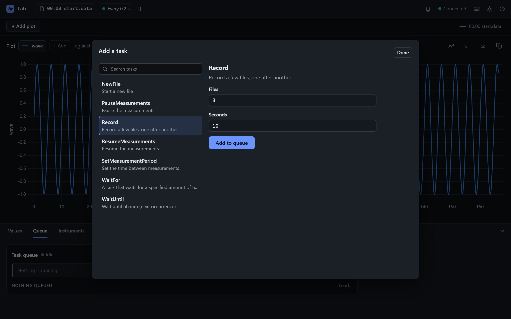
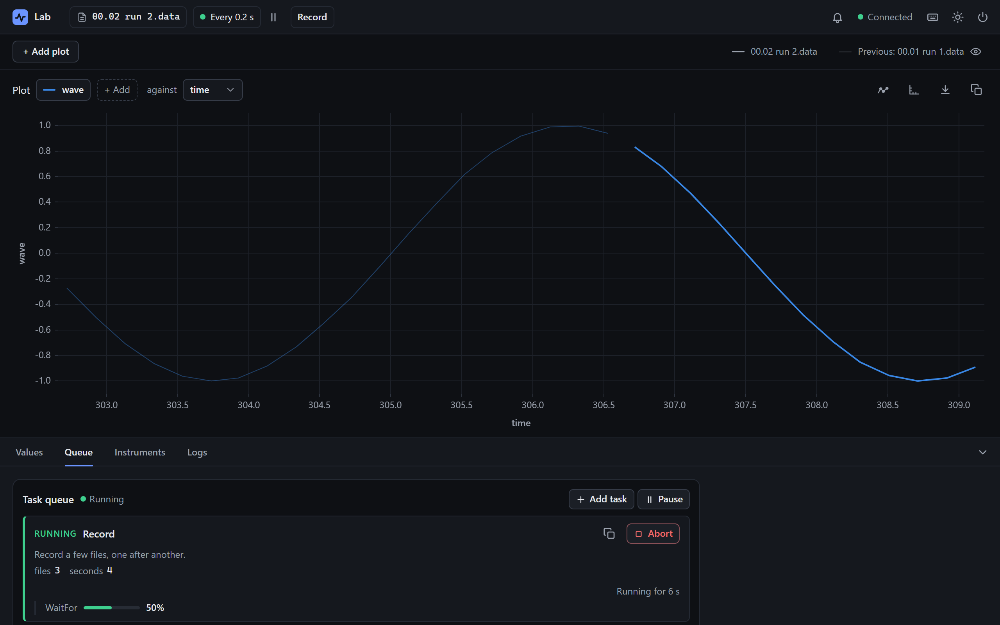

# 2. The Python API

<p class="pa-meta" markdown="span">About 20 minutes · Needs [1. The Config File](config_file.md), and a little Python</p>

A config file says what the rig is, but not what to do with it. That part is Python: putting the instruments into a known state as the experiment starts, and leaving them safe as it ends, working out new columns from each row as it is recorded, and procedures that the experiment runs for you. In this part you keep `rig.toml` as it is, and build a short Python file beside it, a few lines at a time.

You need only a little Python: a class with a few methods, and a `for` loop. Anything more is explained as it comes.

<div class="gs" data-mode="versions" data-file="lab.py" data-lines="20" data-term-lines="4" markdown>

<div class="gs-stage" markdown>

<div class="gs-notes" markdown>

<section class="gs-step" data-new-file data-result="The same interface, now called Lab." markdown>

## Running from Python

Make a file called `lab.py` beside `rig.toml`, and run it:

```python title="lab.py"
--8<-- "examples/getting_started/lab_1.py"
```

```bash
uv run lab.py
```

`Lab` is your experiment. It is a kind of `Experiment`, PyAcquisition's class for one, and adds nothing of its own yet. `Lab.from_config("rig.toml")` makes a `Lab` with the file's instruments and measurements, and `.run()` starts it, as `pyacquisition --toml` did.

The window is the same, but titled `Lab`, after the class. Keep `.run()` under `if __name__ == "__main__":`. The interface starts by importing this file again, and without that line it would start a second experiment.

**More:** [combining a config file with Python](../reference/experiment_options.md#where-a-value-comes-from).
{ .gs-more }

</section>

<section class="gs-step" markdown>

## Experiment setup

```python title="lab.py" hl_lines="7 8 9"
--8<-- "examples/getting_started/lab_2.py"
```

`setup()` is a method of every experiment, which does nothing until you write your own. The experiment calls it once, as `.run()` starts, before the first measurement is read. By then the file's instruments are made, and `self.instruments` has them under the names `rig.toml` gave them.

An instrument's queries and commands are methods you can call. The file says there is a lock-in, but not what state to put it in, so this `setup()` sets its reference frequency to 137 Hz, and every run starts from the same settings. Once it runs, the lock-in's `get_frequency` in the **Instruments** tab answers `137`, since the `mock` adapter answers with the value last set.

**More:** [`setup()`](../reference/python_api/experiment.md#pyacquisition.core.experiment.Experiment.setup), and [the SR 830's commands](../reference/instruments/sr_830.md).
{ .gs-more }

</section>

<section class="gs-step" markdown>

## Experiment teardown

```python title="lab.py" hl_lines="11-14"
--8<-- "examples/getting_started/lab_3.py"
```

`teardown()` is `setup()`'s partner: the experiment calls it once as it ends, after its window has closed but while the instruments are still open. It is the place to leave them safe, and it runs however the experiment ends, even after an error.

The lock-in's sine output drives whatever it is wired to, and would go on doing so after the experiment. So this `teardown()` turns it down to 4 mV, the least an SR830 gives, and says so. When you stop the experiment, the line is among the last in the terminal.

**More:** [`teardown()`](../reference/python_api/experiment.md#pyacquisition.core.experiment.Experiment.teardown), and [the SR 830's commands](../reference/instruments/sr_830.md).
{ .gs-more }

</section>

<section class="gs-step" markdown>

## Add calculations

```python title="lab.py" hl_lines="11"
--8<-- "examples/getting_started/lab_4.py"
```

A **calculation** makes new columns from each row as it is recorded. This one is a function of the row, a `dict` of column names to values, and returns the new column: `power`, the square of `wave`.

The new columns are saved beside the measurements in the data file, and can be plotted like them. A function of your own can only be written in Python, so it is added in `setup()`. The ready-made calculations, such as a rolling mean, can also go in the file.

**More:** [calculations](../usage/calculations.md), and [the ready-made ones](../reference/calculations.md).
{ .gs-more }

</section>

<section class="gs-step" markdown>

## Tasks: custom automation

```python title="lab.py" hl_lines="1 3 4 7-18"
--8<-- "examples/getting_started/lab_5.py"
```

A **task** is a procedure that the experiment runs for you, from its queue, while it goes on measuring: a sweep, a wait, a set of files. Many come with PyAcquisition, and your own can run them in turn.

A task is a `dataclass` of `Task`. Its fields, with their types and defaults, are its inputs, and `run()` does the work. `Record` runs two ready-made tasks, `files` times: `NewFile` starts a new data file, and `WaitFor` waits `seconds` seconds while rows go into it. `run_subtask()` runs a task until it finishes, and `self.log()` writes to the **Logs** tab.

`run()` is `async`, so that while it waits at each `await`, the experiment goes on measuring. The imports grow, for `dataclass`, `Task` and the two tasks.

**More:** [Write a task](../usage/write_task.md), [what `run_subtask()` does](../reference/python_api/task.md#pyacquisition.core.task_manager.task.Task.run_subtask), and [every ready-made task](../reference/tasks/overview.md), such as [NewFile](../reference/tasks/new_file.md) and [WaitFor](../reference/tasks/wait_for.md).
{ .gs-more }

</section>

<section class="gs-step" markdown>

## Register your task

```python title="lab.py" hl_lines="29"
--8<-- "examples/getting_started/lab_6.py"
```

A task you write isn't offered anywhere until it is registered. `register_task`, in `setup()`, lists `Record` in the interface's **Add task**, with its docstring as its description, and a form made from its fields, for `files` and `seconds`.

`label` is the name it is listed under. Without one, it is the class's name.

**More:** [registering tasks](../reference/python_api/experiment.md#pyacquisition.core.experiment.Experiment.register_task), and [Write a task](../usage/write_task.md), for one of your own that drives hardware.
{ .gs-more }

</section>

<section class="gs-step" data-result="Record is in Add task. Queue it." markdown>

## Run the experiment

```bash
uv run lab.py
```

A running experiment doesn't see changes to its file, so stop the one from the first step if it is still open, and run it again.

In the **Queue** tab, choose **Add task**, then **Record**. Change its inputs if you like, and choose **Add to queue**. With nothing else waiting, it starts at once. It makes a new data file named `run 1` and records into it for 10 s, then `run 2`, then `run 3`, each with a `power` column.

In `data` they are numbered on from this run's first file: `03.01 run 1.data` after `03.00 start.data`, if you have run every step.

When they are done, close the window and choose **Stop experiment**. `teardown()` runs, and the terminal says `The lock-in's output is turned down.`

**More:** [the queue](../usage/queue.md), and [pausing, resuming and aborting a task](../usage/queue.md#pause-resume-and-abort).
{ .gs-more }

</section>

</div>

</div>

</div>

## What you built

Your task, in **Add task**, with a form made from its fields:

{ .pa-shot }

And running. The queue shows `Record` and the step it is on, and the plot draws the new file over the one before it:

{ .pa-shot }

!!! success "Checkpoint"
    In the **Instruments** tab, the lock-in's `get_frequency` answers `137`. **Record** is in **Add task**, and queued, it writes three files, `run 1` to `run 3`, each with a `power` column beside `wave`. When you stop the experiment, the terminal says `The lock-in's output is turned down.`

??? failure "Something not working?"
    - **The experiment stops as it starts, with `Task group terminated due to an error: 'lockin'`.** The name in quotes isn't in `self.instruments`, which has the names that `rig.toml` gives the instruments. `self.instruments["lockin"]` needs the `[instruments.lockin]` table from part 1 in the file, spelt the same.
    - **Record isn't in Add task.** Run `uv run lab.py`, not `uv run pyacquisition --toml rig.toml`: the file on its own doesn't know about your task. Then check the `register_task` line.
    - **An error about a new process and bootstrapping (Windows).** `.run()` is not under the `if __name__ == "__main__":` line.

## What you learned

- `from_config` makes an experiment of your own class from the file. The file describes the rig, and the class adds what a file can't say.
- `setup()` runs once as the experiment starts, with the file's instruments in `self.instruments`. It is the place to put them into a known state, and to add calculations and tasks.
- `teardown()` runs once as the experiment ends, however it ends, while the instruments are still open. It is the place to leave them safe.
- A **calculation** makes new columns from each row, saved beside the measurements.
- A **task** is a procedure the experiment runs from its queue: a dataclass with an `async` `run()`, which can run other tasks. Once registered, it is in **Add task**, with a form made from its fields.

Next: [Usage](../usage/index.md) takes each part further, a topic to a page.
