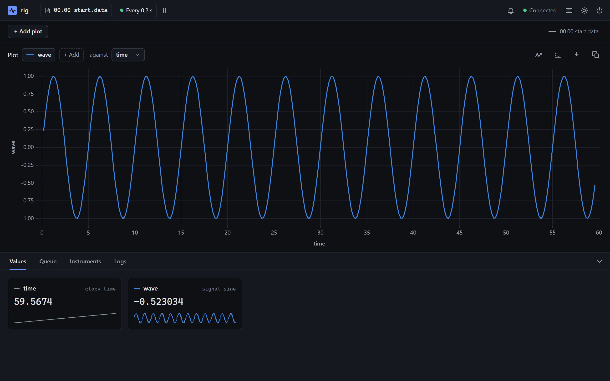
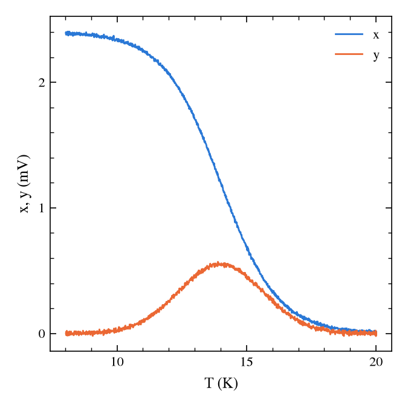

# The interface

Every part of the window, its keyboard shortcuts, and the command palette. [1. The Config File](../getting_started/config_file.md#what-you-built) opens it for the first time.

The window is a page served by the experiment itself, so you can also open it in a browser at [http://localhost:8000](http://localhost:8000) (the API server's address), on this computer or another. It has three parts: a slim bar across the top, the plots filling the window, and a **dock** of tabs along the bottom.

{ .pa-shot }

## The top bar

| Part | What it does |
|---|---|
| **Data file** | The file being written. Click it for its folder (with buttons to copy the path and to open it), and to start a new file: type a title, tick **Start a new block** if you want one, and it shows the name the file will get. |
| **Measurements** | How often everything is measured, such as **Every 0.25 s**. Click it to change the period. It also says how long the loops really take, which is longer than the period if measuring takes longer, and then a **slow** marker appears on it. The button beside it pauses and resumes measuring. |
| **Running task** | The task that is running, and how far along it is, if it says. Click it to open the **Queue** tab. |
| **Bell** | Alerts: an error logged, a task that failed, data that stopped arriving, or the connection to the experiment lost. Each shows for a few seconds, and the bell keeps a list. |
| **Connected** | Whether the experiment is answering. If it stops, the page reconnects by itself when it can. |
| Keyboard, moon and power buttons | The keyboard shortcuts, the light or dark theme (it follows Windows until you choose), and stopping the experiment. |

## The plots

Each plot shows one or more columns against another. The chips along its top are the columns plotted, each in its own colour (the same colour as its tile in the **Values** tab): click one to hide or show it, click its **×** to take it off, and use **+ Add** to add another. **against** chooses the horizontal axis. The line-and-dots button chooses how it is drawn: **Lines**, **Points** or **Both**. The axis button sets fixed limits or a log scale for either axis, the download button saves the plot as a picture, the data in view as a CSV file, or a Python script that draws it, as it looks or as a figure for a paper, and the last buttons copy or remove the plot.

- **Zoom** by dragging a box. A thin box zooms one axis only. **Pan** by dragging with Shift or the middle button, or by scrolling. Ctrl and the scroll wheel zoom about the pointer.
- While zoomed or panned, the plot holds that view as data arrives, and says **Autoscale off**. **Autoscale** there, or a double-click, sets it following the data again.
- Hover over a plot to read the values of the nearest row.
- **+ Add plot** adds another (up to six), and **Link x-axes** zooms and pans the x axes of plots against the same column together.
- The plots show the whole of the current data file, and the file before it, drawn fainter (the key at the top right hides or shows it). Calculated columns can be plotted too.
- **Export**, then **Python script (matplotlib)**, shows a script that draws the plot again with matplotlib, for a paper or a slide, with **Copy** to put it on the clipboard and **Save…** to save it as a file. It draws the same columns, labels, log axes, marks and colours, and the same limits if the plot was zoomed or had fixed limits. It reads the data files where they are (or beside itself, if they have moved), and draws the whole of each file as it stands when you run it, not only what the plot held. It needs pandas and matplotlib (`pip install pandas matplotlib`). It is plain code, meant to be changed: fonts, sizes, labels, anything.
- **Publication figure (APS style)** shows a script like it that draws a figure for a paper, in the style of APS journals (PRB, PRL): one column (3.375 in) wide and square, serif fonts, ticks inward on all four sides, and each axis scaled so its numbers are short, with the SI prefix in its unit (`x (mV)`, not `x (V)` with numbers like 0.0024). Running it saves the figure as a PDF beside the script. The size, the labels, the scales and every part of the style are plain lines at the top of the script, to change as you like.

    { .pa-shot .pa-small }

## The dock

| Tab | Shows |
|---|---|
| **Values** | A tile for each column: its latest value, its unit, where it comes from, and a small graph of its recent values. |
| **Queue** | Each task manager's queue: the task running, with how far along it is and **Abort**, and the tasks waiting, which can be dragged into a new order, moved, copied or removed. **Add task** queues a task from a form, **Pause** and **Resume** hold the queue, and **Save…** and **Load…** keep a queue as a sequence to use again. The running task's card is green while it runs, amber while its queue is paused, and red while it is being aborted. With several task managers, each has a section of its own, and the top bar names the first task running, with a count of the others (**+1**). |
| **Instruments** | Every instrument, with its queries and commands. Pick one, fill in its form, and press **Read** or **Send**. The answers are kept beside the form, with how long each call took, and a button to copy it. |
| **Logs** | What the experiment is doing, as it does it, one line per message. Choose which levels to show, and search. Click a message to see all of it. |

Drag the top edge of the dock to make it taller or shorter, and click the open tab (or the arrow at the right) to hide it. The plots, the dock and the theme are remembered for the next run of the same experiment.

## The keyboard

| Key | Does |
|---|---|
| ++space++ | Holds every plot where it is, or sets them all following the data again. |
| ++1++ to ++4++ | Opens the **Values**, **Queue**, **Instruments** or **Logs** tab. |
| ++grave++ | Hides or shows the dock. |
| ++t++ | Switches between the light and dark themes. |
| ++ctrl+k++ | Opens the [command palette](#the-command-palette). |

## The command palette

++ctrl+k++ opens one search over everything you can do from the keyboard: every task, on every task manager, every instrument's queries and commands, and the interface's actions. Type a few letters of what you want. The best match is picked, with its form beside the list, and the arrow keys pick another. Each is tagged with what it is: a task, a query or command, or an action on the Experiment, a Queue, a Plot or the View.

- **Actions** are what the interface's buttons and keys do, and they run at once: **New data file**, **Pause measurements**, **Set measurement period**, **Pause queue**, **Clear queue**, **Load saved sequence**, **Open the Logs tab**, **Add a column to a plot**, **Switch to the dark theme**, **Go to the last error**, **Shut down the experiment** and others. Those that can't be undone, such as aborting a task, ask first.
- **Tasks** are queued, as from **Add task**. **Queries and commands** are sent to the instrument, and the reply is shown under the form.

*Type the inputs on the same line*, after the search, and the form fills in as you type:

| You type | It does |
|---|---|
| `wait 0 5` | Queues **WaitFor** with 0 hours and 5 minutes. The seconds keep their default. |
| `wait seconds=30` | Queues it with 30 seconds: `name=value` gives an input by its name, in any order. |
| `new file cold run` | Queues **NewFile** with the file name `cold run`. |
| `clock read_timer lap` | Reads the clock's timer `lap`, and shows the reply. |
| `set measurement period 10` | Measures every 10 s from now on. |

- The search ends at the first number, quoted text or `name=value`, or at the first word that no item has. What follows is the inputs.
- Values fill the inputs in order, each going to the next one that can take it, so a number passes over a choice that doesn't list it. A choice can be typed by its value or its label, ignoring spaces, underscores and case (`output_1` for **Output 1**), and a yes-or-no input as yes, no, true, false, on, off, 1 or 0. Quotes (`"cold run"`) keep spaces in one value, and words that nothing else takes join the text before them.
- ++tab++ fixes the item picked, so everything typed after its name is its inputs, even words that other items have.
- A line under the search shows each input and its value, and anything wrong, which is marked on the form too.
- ++enter++ runs it (queues the task, sends the command, reads the query, or runs the action) when its inputs are all there and right, or when it takes none. Otherwise it goes to the form: to the first input that is wrong, or, with nothing typed after the search, to the first input, to fill it in there.

*Now, or in its turn.* An instrument's query or command, and the four actions that a task can also do (**New data file**, **Pause measurements**, **Resume measurements** and **Set measurement period**), can be queued instead, to run once the tasks before them are done: ++shift+enter++ queues it, and so does its form's **Add to queue**. `lakeshore set_setpoint output_1 300` and ++shift+enter++ sets the setpoint after the wait already queued, and `set measurement period 10` and ++shift+enter++ slows the measurements then (as the task `SetMeasurementPeriod`). With more than one task manager, the list beside **Add to queue** picks which queue.

*Recent runs come first.* With nothing typed, the list starts with what you ran from the palette lately, under **Recent**, newest first, each with its inputs (`hours=0, minutes=5, seconds=0`). The first is picked: ++enter++ does it again, the same way (queued, if it was), and ++tab++ opens its form to change it first. Running it with other inputs adds another. The last 20 are kept with the layout, so they come back on the next run. A recent whose task or instrument has gone is hidden until it is back.
