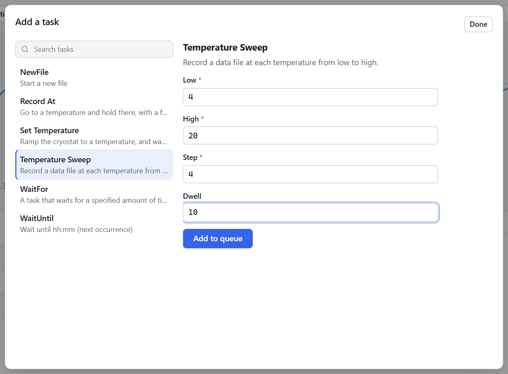
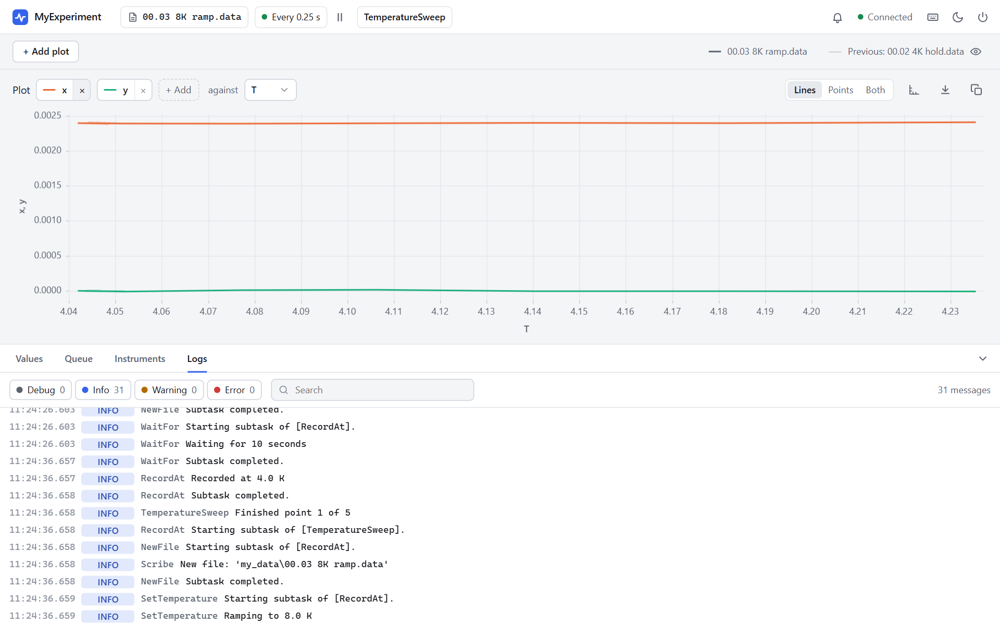
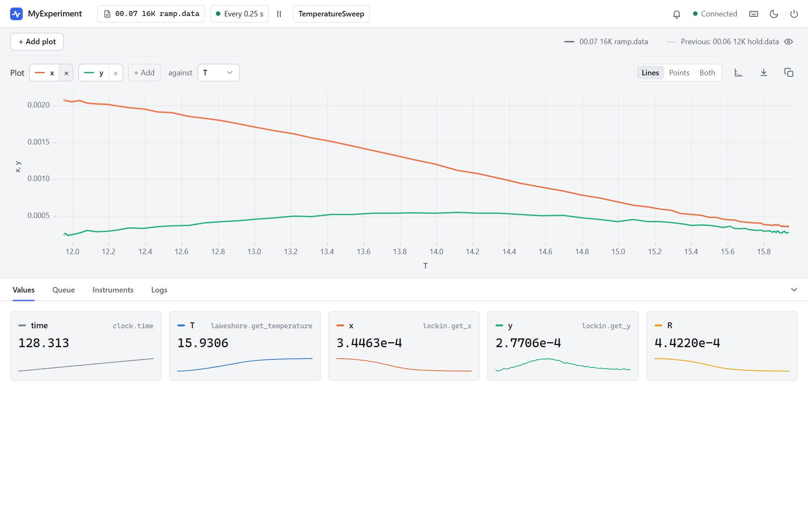
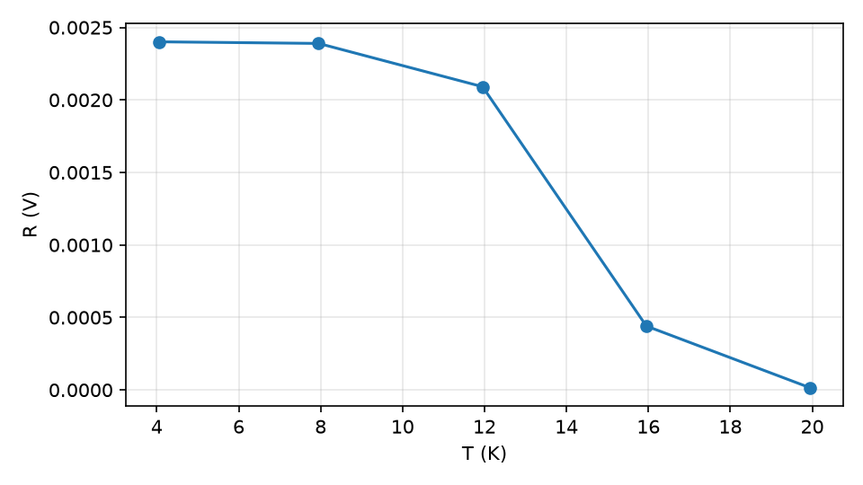

# 5. Composing Tasks

<p class="pa-meta" markdown="span">About 15 minutes · Needs [lesson 4](first_task.md)</p>

Real procedures are made of stages. In this lesson you will build a whole **temperature sweep** out of small tasks: go to a temperature, record there, move to the next. Then you will analyse the result. This is where `pyacquisition` earns its keep, because a task can run *any other task*.

## Tasks that run tasks

Inside `run()`, a task can run another task with `await self.run_subtask(...)`. The subtask goes through its whole life (`setup()`, `run()`, then `teardown()`), its steps are logged under its own name, and then control returns to the task that started it.

That means you can build a procedure the way you would describe it:

- *Record at a temperature* means: start a file, go to the temperature, start another file, wait.
- *A sweep* means: record at each of several temperatures.

Each of those is a small task, and the second is built out of the first. You already have the first building block: `SetTemperature`.

## Record at a temperature

<div class="pa-annot" data-source="examples/tutorial/step_5_composing_tasks.py:record_at" markdown>

<div class="pa-ide" markdown>

```python title="my_experiment.py" linenums="1" hl_lines="13-16 17"
--8<-- "examples/tutorial/step_5_composing_tasks.py:record_at"
```

</div>

<div class="pa-annot__notes" markdown="0">
<div class="pa-note" style="--from: 13; --to: 16" data-contains="run_subtask"><b>Four subtasks, in order</b><span><code>run_subtask</code> runs any task, standard or your own. The ramp and the hold each get a file.</span></div>
<div class="pa-note" style="--from: 17; --to: 17" data-contains="self.log"><b>Say what happened</b><span>The message is labelled with this task's name.</span></div>
</div>

</div>

`RecordAt` does four things, one after another, and each is a subtask: it starts a file, runs the `SetTemperature` you wrote in the last lesson, starts another file, and waits, so that the hold lasts `dwell` seconds. `NewFile` and `WaitFor` are [standard tasks](../tasks/overview.md), so they need no registering to use as subtasks. Ask for one as you would any object, with its inputs.

There is nothing in `run()` about pausing or aborting. A task that runs subtasks can be paused and aborted, because each subtask can be.

Notice the two files. Why not one?

!!! info "A lesson from the data"
    The first version of this task made a single file per temperature: arrive, then start a file, then wait. But the *next* task starts moving the temperature straight away, and nothing has started a new file yet, so the ramp to the next temperature was recorded into the file of the last one. The "4 K" file had a mean temperature of 5.6 K.

    Recording each transient into a file of its own (`ramp`) keeps it out of the file you will analyse (`hold`). Whenever a procedure has parts you want to analyse separately, give each part its own file.

## Sweep it

Now a task built from `RecordAt`:

<div class="pa-annot" data-source="examples/tutorial/step_5_composing_tasks.py:sweep" markdown>

<div class="pa-ide" markdown>

```python title="my_experiment.py" linenums="1" hl_lines="5-8 15-20"
--8<-- "examples/tutorial/step_5_composing_tasks.py:sweep"
```

</div>

<div class="pa-annot__notes" markdown="0">
<div class="pa-note" style="--from: 5; --to: 8" data-contains="dwell"><b>Plain numbers in</b><span>Every input is a plain number, so it fits the form. The task builds what it needs from them.</span></div>
<div class="pa-note" style="--from: 15; --to: 19" data-contains="RecordAt"><b>Tasks built from tasks</b><span>Works out the temperatures (<code>round</code> guards against float error), then runs a <code>RecordAt</code> for each. Tasks nest to any depth.</span></div>
<div class="pa-note" style="--from: 20; --to: 20" data-contains="self.log"><b>Report progress</b><span>One log line per point.</span></div>
</div>

</div>

A sweep runs a `RecordAt`, which runs a `SetTemperature`: three levels, and you did not have to do anything to make that work.

Register all three tasks in `setup()`:

```python
self.register_task(SetTemperature, label="Set Temperature")
self.register_task(RecordAt, label="Record At")
self.register_task(TemperatureSweep, label="Temperature Sweep")
```

`SetTemperature` and `RecordAt` are useful on their own from **Add task**, but only the sweep needs to be there. You do not have to register a task to use it as a subtask.

Here is the whole file, so that you can check yours against it:

??? example "The complete my_experiment.py"

    ```python title="my_experiment.py" linenums="1"
    --8<-- "examples/tutorial/step_5_composing_tasks.py"
    ```

## Run the sweep

```
uv run my_experiment.py
```

In the **Queue** tab, press **Add task** and pick **Temperature Sweep**. Fill in `low` `4`, `high` `20` and `step` `4`, and change `dwell` from its default of `60` to `10`. That is five temperatures (4, 8, 12, 16 and 20 K), and ten seconds at each.

{ .pa-shot .pa-medium }

Press **Add to queue**, then **Done**, open the **Logs** tab (press ++4++), and watch.

{ .pa-shot }

The file name in the top bar follows the sweep from file to file (here it has reached `00.03 8K ramp.data`), and the log tells the whole story of the nesting. Every line is labelled with the task that logged it. Scroll up to the start and read down:

- `TemperatureSweep` `Starting task.` The sweep begins.
- `RecordAt` `Starting subtask of [TemperatureSweep].` It starts its first `RecordAt`.
- `NewFile` `Starting subtask of [RecordAt].`, then `Scribe` `New file: 'my_data\00.01 4K ramp.data'`. The first thing a `RecordAt` does is start a file.
- `SetTemperature` `Starting subtask of [RecordAt].` The `RecordAt` starts a `SetTemperature`, so this task is two levels down.
- `SetTemperature` `Ramping to 4.0 K`, and later `Arrived at 4.0 K`. The messages you logged in the last lesson.

The labels make a long procedure easy to follow, and the search box finds any line.

The whole sweep takes about two and a half minutes. While you wait, set the plot to show `x` and `y` against `T`, as in [lesson 2](simulated_rig.md#plot-it). The plot shows the file being written and, more faintly, the one before it, so as the sweep moves from file to file it shows the latest stretch: here, the 12 K hold and the ramp to 16 K, right through the transition.

{ .pa-shot }

When it has finished, `my_data` holds a pair of files for each temperature:

```
my_data/
├── 00.00 start.data
├── 00.01 4K ramp.data
├── 00.02 4K hold.data
├── 00.03 8K ramp.data
├── 00.04 8K hold.data
├── 00.05 12K ramp.data
├── 00.06 12K hold.data
├── 00.07 16K ramp.data
├── 00.08 16K hold.data
├── 00.09 20K ramp.data
└── 00.10 20K hold.data
```

The last file, `20K hold`, keeps growing until you start another file or stop the experiment.

## Analyse it

Now use the files the way you would on a real experiment. The `hold` files are the clean ones, so read those, and take the average temperature and signal of each. This needs `matplotlib`, which you install separately:

```
uv add matplotlib
```

```python title="plot_sweep.py" linenums="1"
--8<-- "examples/tutorial/plot_sweep.py"
```

Run it from your project folder with `uv run plot_sweep.py`.

{ .pa-shot .pa-medium }

That is real data from the sweep you just ran: the signal is flat and large in the cold, then collapses through the transition between 12 and 16 K. You could now run a finer sweep (`step` 1, say, between 10 and 18) with no new code, or queue several sweeps overnight.

!!! success "Checkpoint"
    After the sweep, `my_data` holds ten files, `hold` files for 4, 8, 12, 16 and 20 K, and the mean `T` of each `hold` file is within a few hundredths of its name. Your plot shows `R` falling with temperature.

## What you learned

- `await self.run_subtask(...)` runs another task inside this one. Tasks can be built out of tasks, to any depth.
- Give a task only plain inputs (`int`, `float`, `str`, `bool`). It can build the tasks it needs from them, and it can be paused and aborted wherever its subtasks can.
- Use `NewFile` inside a task to put each part of a procedure in its own file, and keep transients out of the data you analyse.
- Everything the sweep logs is labelled with the task it came from.

There is more, including running tasks *at the same time* rather than one after another, in [Composing tasks](composing_tasks.md).

Next: [queue several tasks and stay in control](queueing_tasks.md).
