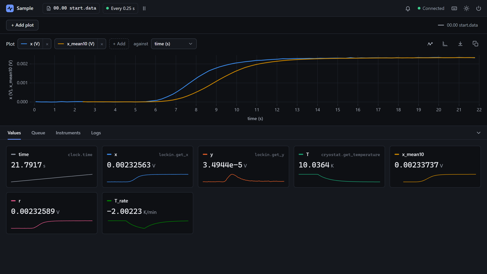

# Calculate new columns

<p class="pa-meta" markdown="span">About 15 minutes · Needs [Getting Started](../getting_started/python_api.md)</p>

A **calculation** makes new columns from each row as it is recorded, saved in the data file beside the measurements, and shown live like them. So what you would work out afterwards is there as you measure. In this tutorial you add three to a sample in a cryostat: its lock-in signal smoothed, the signal's size whatever its phase, and how fast the sample is cooling, which says when a temperature has settled.

You write `sample.py` in your `my-lab` project, beside `simulated.py`: a cryostat, and a lock-in on a sample in it, which stand in for a Lakeshore 350 and an SR830. The sample's signal rises as it cools through 14 K.

<div class="gs" data-files="sample.py:versions" data-lines="24" data-term-lines="3" markdown>

<div class="gs-stage" markdown>

<div class="gs-notes" markdown>

<section class="gs-step" data-given markdown>

## Start from the simulated cryostat

```python title="sample.py"
--8<-- "examples/usage/calculations/sample_1.py"
```

Copy this into `sample.py`. It is the sample from [Tune your measurements](measurements.md), at its third step: a clock, the cryostat, and the lock-in on the sample in it, measuring the time, the lock-in's `x` and `y`, and the temperature, `T`, each with its unit.

??? abstract "simulated.py: a cryostat, and a lock-in on a sample in it, simulated"
    Save this beside `sample.py`. It stands in for real hardware, and you don't need to read it.

    ```python title="simulated.py"
    --8<-- "examples/simulated_rig/simulated.py"
    ```

**More:** [Tune your measurements](measurements.md), which builds it.
{ .gs-more }

</section>

<section class="gs-step" markdown>

## Smooth a noisy column

```python title="sample.py" hl_lines="1 30"
--8<-- "examples/usage/calculations/sample_2.py"
```

`add_calculation` adds a calculation. `RollingMean` comes with PyAcquisition: the mean of a column's last few values, here `x`'s last 10, which smooths its noise. Its column is `x_mean10`, and `unit` labels it.

It is empty until it has 10 values, and it lags a signal that is changing: the price of smoothing. `Sum`, the other that comes with PyAcquisition, adds columns together.

??? tip "In a config file"
    Both can go in a config file's `[calculations]` instead, named by their new column:

    ```toml
    [calculations.x_mean10]
    calculation = "RollingMean"
    column = "x"
    window = 10
    unit = "V"
    ```

**More:** [`RollingMean` and `Sum`](../reference/calculations.md), and [the `[calculations]` table](../reference/config_file.md#calculations).
{ .gs-more }

</section>

<section class="gs-step" markdown>

## Work out a column from others

```python title="sample.py" hl_lines="1 33 36-38"
--8<-- "examples/usage/calculations/sample_3.py"
```

A calculation can also be a function. It is given the row, a `dict` of the columns so far by name, and returns a `dict` of new columns. `magnitude` gives `r`, the size of the lock-in's signal, √(x² + y²), which doesn't depend on its phase. `units` gives each new column its unit.

The calculations run in the order they are added, after the measurements, and each can use the columns made before it.

**More:** [`add_calculation`](../reference/python_api/experiment.md#pyacquisition.core.experiment.Experiment.add_calculation), and [Calculations](../reference/calculations.md).
{ .gs-more }

</section>

<section class="gs-step" markdown>

## Keep state between rows

```python title="sample.py" hl_lines="2 4 35 43-56"
--8<-- "examples/usage/calculations/sample_4.py"
```

A function sees one row. A calculation that remembers earlier rows is a class based on `Calculation`: it is called with each row, and keeps what it needs on `self`. `Rate` keeps a column's last 20 values with their times, and gives how fast it is changing, per minute. So `T_rate` is how fast the sample is cooling or warming, and when it is near 0, the temperature has settled.

`columns` names what it makes, so that if it fails on a row, that row's cell is left empty, and the column is never lost.

**More:** [`Calculation`](../reference/calculations.md#calculation).
{ .gs-more }

</section>

<section class="gs-step" markdown>

## Run the experiment

```bash
uv run sample.py
```

Plot `x` and `x_mean10` against `time`. Then, in the **Instruments** tab, pick `cryostat` and `set_setpoint`, with **Output Channel** Output 1 and **Setpoint** 10, and **Send**. `T_rate` falls to about −90 K/min as the sample cools, then back towards 0 as it settles, and `x_mean10` follows `x`, a little behind.

??? note "When a calculation fails"
    An error in a calculation is logged, as `[Calculations] Error in calculation magnitude: …`, its cells in that row are empty, and the rest carry on. A file's columns are fixed by its first row, so a function that fails on the first row, or leaves a column out of it, has that column left out of the file. A `Calculation` names its `columns`, so it can't lose them.

**More:** [the plots](../reference/interface.md#the-plots), and [what a data file holds](../reference/data_files.md#the-data-file).
{ .gs-more }

</section>

</div>

</div>

</div>

## What you built

The sample cooled from 20 K to 10 K:

<div class="gs-shot" markdown>

{ .pa-shot }

<span class="gs-pin" style="--x: 44.0%; --y: 29.0%">1</span>
<span class="gs-pin" style="--x: 13.5%; --y: 77.2%">2</span>
<span class="gs-pin" style="--x: 29.6%; --y: 83.3%">3</span>

</div>

<div class="gs-legend" markdown>

1. **The smoothed signal.** `x_mean10` follows `x`, a little behind.
2. **The signal's size.** `r`, from `magnitude`, in V.
3. **How fast it is cooling.** `T_rate`, in K/min: its dip is the cooldown, and it is back near 0 as the temperature settles.

</div>

!!! success "Checkpoint"
    The **Values** tab has tiles for `x_mean10` and `r` in V, and `T_rate` in K/min, and the data file has them as columns after the measurements: `time,x,y,T,x_mean10,r,T_rate`. After `set_setpoint` to 10, `T_rate` falls to about −90 K/min, and comes back towards 0 as `T` settles.

??? failure "Something not working?"
    - **`ModuleNotFoundError: No module named 'simulated'`.** `simulated.py` isn't beside `sample.py`, or the terminal is in another folder.
    - **The log says `[Calculations] Error in calculation magnitude: 'Y'` on every row.** The row has no column of that name. Names are case sensitive, and a calculation sees only the measurements and the calculations added before it. A built-in says so too: `Error in calculation RollingMean: 'X'`.
    - **The experiment stops as it starts, with `Task group terminated due to an error: units must be a dict of column name to unit, such as {"power": "W"}`.** A function's units go in a `dict`, by column: `units={"r": "V"}`. The built-ins take one, `unit="V"`.
    - **The log says `[Calculations] Column 'r' was not in the first row, so it is left out of the data.`** A function didn't give `r` on the first row, since it failed or left it out, so the file has no `r` column. Make it give every column on every row, or make it a `Calculation` with `columns`.

## What you learned

- A calculation adds columns to each row as it is recorded, saved in the data file after the measurements.
- `RollingMean` and `Sum` come with PyAcquisition, and can go in a config file too.
- A function of the row makes columns from the others, and `units` gives them their units.
- A `Calculation` subclass keeps state between rows, and names its `columns`, so they are never lost.

Next: [Record spectra and traces](traces.md), for an instrument that gives a whole array at a time.
