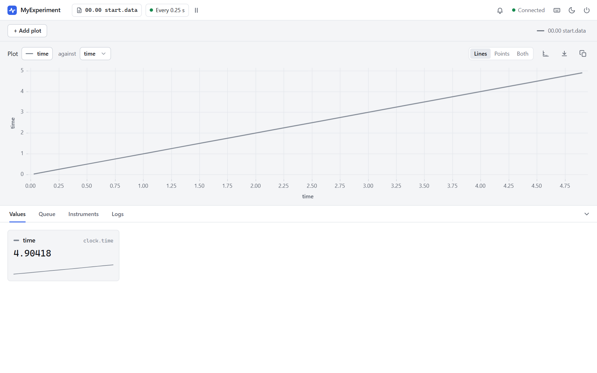

# 1. Your First Experiment

<p class="pa-meta" markdown="span">About 5 minutes · Needs [Installation](installation.md)</p>

In this lesson you will write the smallest useful experiment, run it, and find your way around the window that opens. It measures nothing but the time, which is enough to see every part of the machinery working.

## Write it

In the project folder you made during [installation](installation.md), create a file called `my_experiment.py`:

Every experiment has this same shape, so it is worth reading slowly once. The notes beside the code say what each part does.

<div class="pa-annot" data-source="examples/tutorial/step_1_first_experiment.py" markdown>

<div class="pa-ide" markdown>

```python title="my_experiment.py" linenums="1" hl_lines="5-7 9-11 13 16-17"
--8<-- "examples/tutorial/step_1_first_experiment.py"
```

</div>

<div class="pa-annot__notes" markdown="0">
<div class="pa-note" style="--from: 5; --to: 7" data-contains="class MyExperiment"><b>Your experiment</b><span>It inherits the recording, the interface and the task queue. Options such as <code>data_path</code> go in the class body.</span></div>
<div class="pa-note" style="--from: 9; --to: 11" data-contains="add_instrument"><b>Add an instrument</b><span><code>setup()</code> runs once, before the start. A <code>Clock</code> reports time, and its id must be unique.</span></div>
<div class="pa-note" style="--from: 13; --to: 13" data-contains="add_measurement"><b>Add a measurement</b><span>Pass the method, not its result: <code>clock.time</code>, not <code>clock.time()</code>.</span></div>
<div class="pa-note" style="--from: 16; --to: 17" data-contains=".run()"><b>Run it</b><span>Only under the guard. The interface re-imports this file.</span></div>
</div>

</div>

Two options are set in the class body. `data_path = "my_data"` says where data files go, and `gui_log_level = "INFO"` keeps the **Logs** tab readable, because by default it shows every debugging message, which is very chatty. All the options are listed on the [Experiment options](setting_up.md#experiment-options) page.

An **instrument** is a Python object that represents something you can read from or control. A `Clock` is a built-in software instrument that reports elapsed time, and the text `"clock"` is its **id**. A **measurement** records one of an instrument's queries, here under the column name `time`, on every cycle. You give the measurement the *method* and it calls it for you, over and over.

??? note "Why does that last line matter so much?"
    The graphical interface runs in a separate process, which starts by importing your script again. Without the `if __name__ == "__main__":` guard, that second process would try to start a second experiment of its own. On Windows this fails at once with an error about *"a new process before the current process has finished its bootstrapping phase"*. Always put `.run()` under the guard. The [interface and API page](running.md#always-use-a-main-guard) has more.

## Run it

From your project folder:

```
uv run my_experiment.py
```

After a moment a window opens. The experiment is running: it is reading the clock four times a second and saving every reading to a file.

{ .pa-shot }

Take a tour of what you are looking at:

| Part | What it is |
|---|---|
| **Top bar** | The file that data is being written to (`00.00 start.data`), and how often everything is measured (**Every 0.25 s**), with a button to pause measuring. Click either for more. At the right: alerts, whether the experiment is answering, the keyboard shortcuts, the theme, and stopping. |
| **Plot** | A live graph, here of `time` against itself, since it is the only column. You will choose what it shows in the next lesson. |
| **Values** | A tile for each measurement, updating as it arrives: its name, the instrument and query it comes from, its latest value, and a small graph of its recent values. |
| **Queue**, **Instruments**, **Logs** | The other tabs of the dock: the procedures that are running or waiting (nothing yet), everything each instrument can do, and what the experiment is doing, one line per message. Press ++1++ to ++4++ to switch between the tabs. You will use all of them in the next lessons. |

Everything in that window was generated from a dozen lines of Python. There is no GUI code in your script.

## Look at your data

Look in your project folder. There is a new `my_data` folder, and in it a file named `00.00 start.data`. It is plain text: a header row of measurement names, then one row for every cycle.

```
time
10.96821117401123
11.218265056610107
11.468185186386108
```

Every measurement you add becomes another column. You will add some in the next lesson.

## Stop it

Close the window, and choose **Stop experiment** when it asks. This shuts everything down cleanly.

Run it again and look in `my_data`. This time there is also a `01.00 start.data`. Every run starts a new *block*, so a run never overwrites the data of an earlier one. [Lesson 3](recording_data.md) explains the file names.

!!! success "Checkpoint"
    You have a window with a **Values** tile showing `time` counting up, and a `00.00 start.data` file in `my_data` that grew while it ran.

??? failure "Something not working?"
    - **`ModuleNotFoundError: No module named 'pyacquisition'`.** You ran the script with a Python that does not have it installed. Run it with `uv run my_experiment.py` from the project folder you made in [installation](installation.md).
    - **An error about a new process and bootstrapping (Windows).** The `if __name__ == "__main__":` line is missing, or `.run()` is outside it.
    - **An error that the API server can't listen, because every port is taken.** Another experiment (or another program) is using the API port. Close it, or give this one a different port by adding `api_server_port = 8001` to your experiment class. To have it move to a free port by itself, list some to try: `api_server_fallback_ports = [8001, 8002, 8003]`.
    - **No window appears.** Look at the terminal for an error. The experiment needs a graphical desktop, unless you turn the window off with `gui=False` (and open [http://localhost:8000](http://localhost:8000) in a browser instead).
    - **The window says it needs the Microsoft Edge WebView2 Runtime.** Some older Windows 10 PCs do not have it. Install it from the address the window gives, and run the experiment again. Until then the experiment runs regardless, and the other address it gives shows it in a browser.

## What you learned

- An experiment is a class with a `setup()` method that adds instruments and measurements.
- A **measurement** is a query that is read on every cycle and saved to a column of the data file.
- The interface, the recording and the files all come from `Experiment`. You only describe *what* to measure.

Next: [make it a rig with real things to measure](simulated_rig.md).
