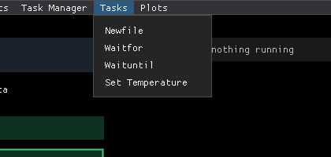
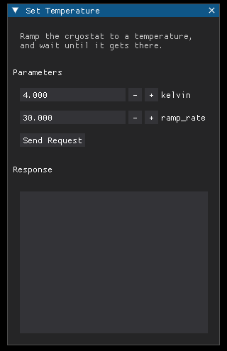
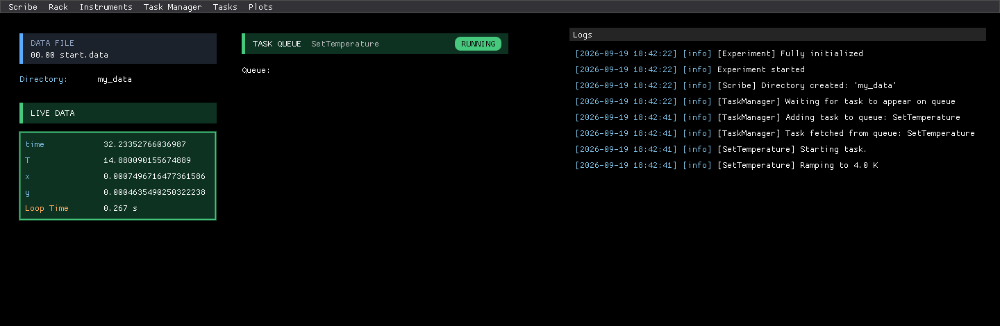

# 4. Your First Task

<p class="pa-meta" markdown="span">About 12 minutes · Needs [lesson 3](recording_data.md)</p>

So far you have driven the rig by clicking. In this lesson you will write a **task**: a procedure that runs on your experiment by itself. You will write one that ramps the cryostat to a temperature and waits until it gets there.

## What a task is

A task is a procedure that you want to run on your experiment: ramp a temperature, wait an hour, start a new file, sweep a field. Tasks are run from a queue, one at a time, and can be paused or aborted while they run.

You write a task as a class with a `run()` method. Everything else (the queue, the buttons, the log messages, the form in the **Tasks** menu) comes for free.

A few tasks are already included. Open the **Tasks** menu:

{ .pa-shot .pa-small }

`Newfile` starts a new data file, `Waitfor` waits for a time, and `Waituntil` waits until a clock time. Your own tasks will join them in a moment.

## Write the task

Add this to `my_experiment.py`, above your `MyExperiment` class. The notes beside the code say what each part does:

<div class="pa-annot" data-source="examples/tutorial/step_4_first_task.py:task" markdown>

<div class="pa-ide" markdown>

```python title="my_experiment.py" linenums="1" hl_lines="1-3 5-6 8-10 12-16 18-22 24-28"
--8<-- "examples/tutorial/step_4_first_task.py:task"
```

</div>

<div class="pa-annot__notes" markdown="0">
<div class="pa-note" style="--from: 1; --to: 3" data-contains="class SetTemperature"><b>A task is a dataclass</b><span>Every task is a <code>@dataclass</code> that inherits <code>Task</code>. The first line of its docstring is shown in the Tasks menu.</span></div>
<div class="pa-note" style="--from: 5; --to: 6" data-contains="ramp_rate"><b>Inputs</b><span>Annotated attributes become boxes in the Tasks menu: int, float, str or bool.</span></div>
<div class="pa-note" style="--from: 8; --to: 10" data-contains="description"><b>Describe it</b><span>Shown for a task waiting in the queue. Optional, but worth writing.</span></div>
<div class="pa-note" style="--from: 12; --to: 16" data-contains="self.log"><b>The work</b><span><code>run()</code> is <code>async</code>. Instrument calls are ordinary calls, and <code>self.log</code> writes to the Logs window.</span></div>
<div class="pa-note" style="--from: 18; --to: 22" data-contains="wait_until"><b>Wait, never sleep</b><span><code>wait_until</code> checks every second, and it is where the task can be paused or aborted.</span></div>
<div class="pa-note" style="--from: 24; --to: 28" data-contains="teardown"><b>Always runs</b><span><code>teardown()</code> runs however the task ends: finished, aborted or failed. Here it stops the ramp where the sample is.</span></div>
</div>

</div>

An input without a default, like `kelvin`, must be given. One with a default, like `ramp_rate`, may be left out when you create the task in code. `experiment.instruments` is how a task reaches the instruments you added in `setup()`, by id.

`run()` is an `async` method, which sounds like more than it is. You only need three rules:

1. **Wait with `await self.sleep(seconds)` or `await self.wait_until(condition)`.** They wait without freezing anything else, and they are the places where you can **pause or abort** the task. Here, `wait_until` checks every second whether the temperature is within 0.05 K of the target. Never use `time.sleep()` in a task: it would freeze the whole experiment while it waits.
2. **Say what is happening with `self.log("...")`.** Whatever you log is written to the log, labelled with the name of the task.
3. **Everything else is ordinary Python.** Loops, conditions, calling instrument methods, arithmetic. Instrument calls are normal function calls with no `await`.

Read `run()` again with those rules in mind. It sets the ramp rate and the setpoint (two commands), logs what it did, and waits until the temperature is within 0.05 K of the target. When it gets there, it logs a message and finishes.

**Why `teardown()` matters.** It **always runs when the task ends**: when it finishes, when you abort it, and when it hits an error. Use it to leave your instruments somewhere safe. Wherever the task stopped, the setpoint is set to the temperature the sample is at right now, so the controller stops ramping and simply holds. Without it, aborting a ramp to 4 K would leave the setpoint at 4 K and the cryostat still heading there.

!!! warning "Inputs cannot be called `start`, `name`, `run` and so on"
    A task already has attributes called `name`, `description`, `parameters`, `run`, `setup`, `teardown`, `pause`, `resume`, `abort`, `log` and `sleep` (and a few more), and `register_task` uses `label`. Do not name an input after any of them. The full list of pitfalls is in [Writing tasks](tasks.md#things-to-watch-for).

## Register it

A task must be registered in `setup()` to appear in the **Tasks** menu. Add the imports the task needs at the top of the file, and this line at the end of `setup()`:

```python
self.register_task(SetTemperature, label="Set Temperature")
```

Pass the class itself, not an instance: no brackets. `label` is the name shown in the menu. Here is the whole file, with everything that is new highlighted:

```python title="my_experiment.py" linenums="1" hl_lines="2 4 6-10 14-16 18-19 21-23 25-29 31-35 37-41 71"
--8<-- "examples/tutorial/step_4_first_task.py"
```

## Run it

```
uv run my_experiment.py
```

Open **Tasks → Set Temperature**. The window has a box for each input, with the docstring as its description.

{ .pa-shot .pa-small }

Fill in **both** boxes: `kelvin` `4` and `ramp_rate` `30`. The form does not use the defaults from your code, so a `ramp_rate` left at `0` is sent as zero, not as the `30` in the code. Press **Send Request**.

The task joins the queue and starts at once. Look at what happened:

{ .pa-shot }

- The **Task Queue** header turns green and reads **RUNNING**, with the name of the task.
- **Live Data** shows `T` falling, and `x` climbing as it goes.
- The **Logs** window follows the task: the task manager took it from the queue, the task started, and then the message you logged, `Ramping to 4.0 K`.

About forty seconds later the log reads `Arrived at 4.0 K`, the header goes grey and **IDLE**, and the task is done. Run it again with `kelvin` `20` to warm back up.

!!! success "Checkpoint"
    Running **Set Temperature** with `kelvin` 4 takes `T` from 20 K down to 4 K, the log shows `Ramping to 4.0 K` and then `Arrived at 4.0 K`, and the **Task Queue** goes back to **IDLE**.

??? failure "Something not working?"
    - **`T` dives to the target in a few seconds instead of ramping for about forty.** You left `ramp_rate` at `0`, and the simulated controller treats a rate of zero as "no ramp, jump to the setpoint". Fill in every box.
    - **The task never finishes.** It is waiting for `T` to be within 0.05 K of `kelvin`. Check that `kelvin` is a temperature the simulated cryostat can reach, such as 4 or 20.
    - **`Set Temperature` is not in the menu.** Check that the `register_task` line is inside `setup()`, and that you passed the class and not `SetTemperature()`.
    - **The task ends at once, and the queue pauses.** An error inside a task does not crash the experiment. It is shown in the **Logs** window as `Task failed: ...`, with the reason. The queue pauses, so that nothing else runs on top of a task that failed. Fix the cause, and choose **Resume**.

## What you learned

- A **task** is a `@dataclass` class with an `async def run()`.
- **Wait with `await self.sleep()` and `await self.wait_until()`** (that is where it can be paused and aborted), **say what is happening with `self.log()`**, and put safe-state code in **`teardown()`**.
- Task inputs become the form in the **Tasks** menu. Fill in every box.
- Register a task in `setup()` to run it from the interface.

Everything about how tasks run and what can go wrong is in [Writing tasks](tasks.md).

Next: [build a whole sweep out of tasks like this one](building_a_sweep.md).
