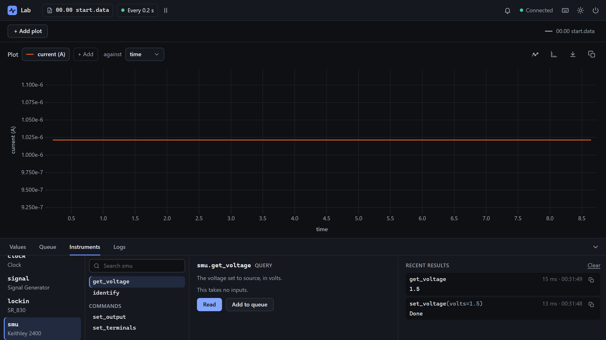

# Write a hardware instrument

<p class="pa-meta" markdown="span">About 20 minutes · Needs [Getting Started](../getting_started/python_api.md). No instrument needed: it runs on `mock`</p>

A driver for an instrument that PyAcquisition has no driver for is a class of your own, like [a software instrument's](software_instrument.md), whose methods send the instrument text and read its replies. In this tutorial you write one for a Keithley 2400 SourceMeter, which is behind many current-voltage measurements: it sources a voltage, and measures the current that flows. Your driver reads the current, sets the voltage, turns the output on and off, and picks the terminals. You try it with no device, on the `mock` adapter.

It starts where [2. The Python API](../getting_started/python_api.md) ends: your `my-lab` project, with `rig.toml` and `lab.py`. You write `keithley_2400.py` beside them. The messages it sends are the 2400's own, from its manual. For another instrument, its manual gives the messages, and the steps are the same.

<div class="gs" data-files="lab.py:versions keithley_2400.py:versions" data-lines="24" data-term-lines="3" markdown>

<div class="gs-stage" markdown>

<div class="gs-notes" markdown>

<section class="gs-step" data-given markdown>

## Start from the Getting Started lab

```python title="lab.py"
--8<-- "examples/usage/hardware_instrument/lab_1.py"
```

This is `lab.py` as [2. The Python API](../getting_started/python_api.md) left it: an experiment of your own made from `rig.toml`, with a calculation, the `Record` task, and the lock-in's setup and teardown.

You add a Keithley 2400 to it, from a driver you write yourself in `keithley_2400.py`, beside it.

**More:** [2. The Python API](../getting_started/python_api.md), which builds it.
{ .gs-more }

</section>

<section class="gs-step" data-new-file="keithley_2400.py" markdown>

## Start a driver class

```python title="keithley_2400.py"
--8<-- "examples/usage/hardware_instrument/keithley_2400_1.py"
```

A driver for hardware is a class based on `Instrument`, which holds the connection to the device. `name` is what the interface calls it, as for [a software instrument](software_instrument.md).

`self.query()` sends the instrument a message, and answers its reply, as text. `identify` sends `*IDN?`, which nearly every instrument answers with its make, model, serial number and firmware. `.strip()` takes the end of the line off the reply.

**More:** [`Instrument`](../reference/python_api/instrument.md#pyacquisition.core.instrument.Instrument), and [the drivers that come with PyAcquisition](../reference/instruments/overview.md).
{ .gs-more }

</section>

<section class="gs-step" markdown>

## Add a query: the current

```python title="keithley_2400.py" hl_lines="15-20"
--8<-- "examples/usage/hardware_instrument/keithley_2400_2.py"
```

`:READ?` makes the 2400 take a reading, and answer five numbers, separated by commas: the voltage, the current, the resistance, a time stamp and a status word. The query splits the reply at the commas, and turns the second part into a number, since every reply is text, and a query answers what its return type says.

The comment says what the reply holds, as the manual does, for whoever reads the code next.

**More:** [`mark_query`](../reference/python_api/instrument.md#pyacquisition.core.instrument.mark_query), and [queries in Write a software instrument](software_instrument.md#add-a-query-the-free-space).
{ .gs-more }

</section>

<section class="gs-step" markdown>

## Add a command: the voltage

```python title="keithley_2400.py" hl_lines="1-6 26-29 31-34"
--8<-- "examples/usage/hardware_instrument/keithley_2400_3.py"
```

`self.command()` sends a message, and waits for no reply. `set_voltage` sends `:SOUR:VOLT` with the number, such as `:SOUR:VOLT 1.5`. `get_voltage` asks for the setting back, with the same header and a `?`, as instruments that speak SCPI, like the 2400, do.

A command with a query to read it back lets you check that a setting took. [Verifying a driver](../dev/verifying_hardware.md) tries such pairs on the device.

**More:** [`mark_command`](../reference/python_api/instrument.md#pyacquisition.core.instrument.mark_command).
{ .gs-more }

</section>

<section class="gs-step" markdown>

## Turn the output on and off

```python title="keithley_2400.py" hl_lines="36-39"
--8<-- "examples/usage/hardware_instrument/keithley_2400_4.py"
```

A 2400 sources nothing until its output is on. `set_output` takes `on`, a `bool`, which the interface shows as a checkbox, and sends `:OUTP ON` or `:OUTP OFF`.

A driver's methods are for your code too, not only the interface: `lab.py` turns the output on as the experiment starts, and off as it ends.

**More:** [`mark_command`](../reference/python_api/instrument.md#pyacquisition.core.instrument.mark_command), and [the Instruments tab's forms](../reference/interface.md#the-dock).
{ .gs-more }

</section>

<section class="gs-step" markdown>

## Add a choice: the terminals

```python title="keithley_2400.py" hl_lines="2 9-13 27-30"
--8<-- "examples/usage/hardware_instrument/keithley_2400_5.py"
```

A 2400 has terminals on its front panel and on its back, and `:ROUT:TERM` picks one pair. Its codes, `FRON` and `REAR`, aren't what a reader wants to pick from, so a `BaseEnum` gives each a label. The interface lists **Front** and **Rear**, starting at **Choose…** since there is no default, and `terminals.raw_value` is the code that is sent.

The enum is above the class, since the method's argument names it as its type.

**More:** [`BaseEnum`](../reference/python_api/instrument.md#pyacquisition.core.instrument.BaseEnum), and [choices in Write a software instrument](software_instrument.md#add-a-choice-free-used-or-total).
{ .gs-more }

</section>

<section class="gs-step" markdown>

## Try it with no device

```python title="lab.py" hl_lines="3-4 7-10 37-46 53-55"
--8<-- "examples/usage/hardware_instrument/lab_2.py"
```

In `setup()`, the 2400 is made from your driver, called `smu`, at its usual GPIB address, 24, on the `mock` adapter. `responses` gives the mock replies to give: to `:READ?`, a reading as a 2400 answers it, kept in `READING` at the top. Otherwise the mock answers `0`, which has no second number.

The output is turned on at 0 V as the experiment starts, and off in `teardown()`. `current` records the reading on every cycle. With a 2400 connected, delete `adapter` and `responses`.

**More:** [the `mock` adapter](../reference/adapters.md#mock), and [Connect a real instrument](connect_instrument.md).
{ .gs-more }

</section>

<section class="gs-step" data-result="The 2400's output is off." markdown>

## Run the experiment

```bash
uv run lab.py
```

In the **Instruments** tab, `smu` is listed as **Keithley 2400**. Send `set_voltage` with **Volts** 1.5, then **Read** `get_voltage`: it answers 1.5, since the mock gives back what was last set. `get_current`, and the `current` tile, answer the current in `READING`.

When you close the window, `teardown()` turns the output off, and says so.

**More:** [the Instruments tab](../reference/interface.md#the-dock).
{ .gs-more }

</section>

</div>

</div>

</div>

## What you built

Your driver, in the interface, on `mock`:

<div class="gs-shot" markdown>

{ .pa-shot }

<span class="gs-pin" style="--x: 12.0%; --y: 96.6%">1</span>
<span class="gs-pin" style="--x: 29.1%; --y: 96.5%">2</span>
<span class="gs-pin" style="--x: 70.6%; --y: 85.2%">3</span>
<span class="gs-pin" style="--x: 30.0%; --y: 41.2%">4</span>

</div>

<div class="gs-legend" markdown>

1. **Your instrument.** `smu`, with its driver's `name` under it.
2. **Its commands.** `set_output`, `set_terminals` and `set_voltage`, below its queries.
3. **A setting read back.** `get_voltage` answers 1.5, which `set_voltage` sent, and the mock kept.
4. **The current, recorded.** The mock's reading, on every cycle.

</div>

!!! success "Checkpoint"
    The **Instruments** tab lists `smu` as **Keithley 2400**. After **Send** on `set_voltage` with **Volts** 1.5, **Read** on `get_voltage` answers 1.5. `current` is recorded on every cycle, at 1.02145e-06 A, the current in `READING`. Closing the window prints `The 2400's output is off.`

??? failure "Something not working?"
    - **`ModuleNotFoundError: No module named 'keithley_2400'`.** `keithley_2400.py` isn't beside `lab.py`, or the terminal is in another folder. Both belong in `my-lab`.
    - **The log says `Error in measurement current: list index out of range` on every cycle.** The reply to `:READ?` has no second number. With no `responses`, the mock answers `0`. On a real instrument, look at what it answered: `print(self.query(":READ?"))`.
    - **The experiment stops as it starts, with `Task group terminated due to an error: Instrument.__init__() missing 1 required positional argument: 'resource'`.** The driver was given no address. A hardware driver takes a name and an address, even on `mock`.
    - **`Instrument 'smu': there is no driver called 'Keithley_2400' (did you mean 'Keithley_2000'?)`.** A config file only knows the drivers that come with PyAcquisition. Add a driver of your own in `setup()`.

## What you learned

- A hardware driver is a class based on `Instrument`. `self.query()` sends a message and answers the reply, as text, and `self.command()` sends one and waits for none.
- A query turns the reply into what its return type promises, taking it apart when it holds several values.
- A `BaseEnum` maps the instrument's codes to labels a reader understands.
- `mock` runs a driver with no device. `responses` gives the replies it needs, and it gives back what was last set.
- A driver of your own is added in Python: a config file knows only the ones that come with PyAcquisition.

Next: [verifying a driver on real hardware](../dev/verifying_hardware.md) checks it against the device, before you trust it with a measurement.
