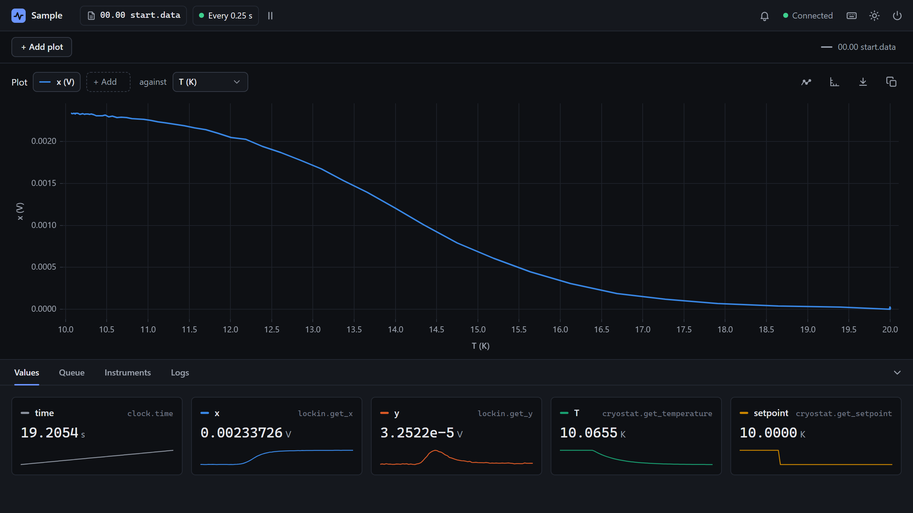

# Tune your measurements

<p class="pa-meta" markdown="span">About 10 minutes · Needs [Getting Started](../getting_started/python_api.md)</p>

A **measurement** reads one query on every cycle, into a column of the data file. Getting Started's have a name, a query, and sometimes arguments. In this tutorial you tune them for a real measurement: a sample in a cryostat, measured with a lock-in as it cools. You give the values units, read the temperature from one of the controller's inputs, and read a value that rarely changes less often, so that the rest are read faster.

You write `sample.py`, a new experiment, in your `my-lab` project. Beside it goes `simulated.py`: a cryostat, and a lock-in on a sample in it, which stand in for a Lakeshore 350 and an SR830, so that it all runs with no hardware. The sample's signal rises as it cools through 14 K.

<div class="gs" data-files="sample.py:versions" data-lines="24" data-term-lines="3" markdown>

<div class="gs-stage" markdown>

<div class="gs-notes" markdown>

<section class="gs-step" data-new-file markdown>

## Start from the simulated cryostat

```python title="sample.py"
--8<-- "examples/usage/measurements/sample_1.py"
```

`sample.py` is an experiment in Python alone, with no config file. `setup()` makes a clock, the cryostat, and the lock-in on the sample in it, adds them, and measures the time and the lock-in's `x` and `y` on every cycle. `Sample().run()` starts it with the default options, which poll every 0.25 s.

??? abstract "simulated.py: a cryostat, and a lock-in on a sample in it, simulated"
    Save this beside `sample.py`. It stands in for real hardware, and you don't need to read it.

    ```python title="simulated.py"
    --8<-- "examples/simulated_rig/simulated.py"
    ```

**More:** [`Measurement`](../reference/python_api/measurement.md), and [2. The Python API](../getting_started/python_api.md), for an experiment in Python.
{ .gs-more }

</section>

<section class="gs-step" markdown>

## Give the measurements units

```python title="sample.py" hl_lines="17-19"
--8<-- "examples/usage/measurements/sample_2.py"
```

`unit` is shown beside each value in the **Values** tab, and on a plot's axis, as `x (V)`. It is for reading: the data file's columns and numbers are the same either way. Any text is a unit (`"mV"`, `"Ω"`), and it isn't passed to the query.

A value with no unit is a number nobody can be sure of a month later, so give every one a unit.

**More:** [`Measurement`](../reference/python_api/measurement.md), and [`unit` in a config file](../reference/config_file.md#measurements).
{ .gs-more }

</section>

<section class="gs-step" markdown>

## Pass a choice: the input channel

```python title="sample.py" hl_lines="3 21-28"
--8<-- "examples/usage/measurements/sample_3.py"
```

A temperature controller reads several thermometers, and `get_temperature` takes which one, `input_channel`: a choice. A measurement passes a query's arguments by name, on every call, here the member `InputChannel.INPUT_A`. The simulated cryostat takes a Lakeshore 350's choices, so they come from its driver. With a real one, `cryostat.InputChannel.INPUT_A` needs no import.

Text works too: the name, `"INPUT_A"`, or the label the interface shows, `"Input A"`, in any case. Text that names no member stops the experiment at setup, and lists those that exist.

**More:** [the Lakeshore 350's queries](../reference/instruments/lakeshore_350.md), and [a choice in a config file](../reference/config_file.md#measurements).
{ .gs-more }

</section>

<section class="gs-step" markdown>

## Read the setpoint less often

```python title="sample.py" hl_lines="3-6 32-40"
--8<-- "examples/usage/measurements/sample_4.py"
```

The measurements are read one after another, every cycle. On real instruments each query takes time, tens of milliseconds over GPIB, so a long list slows every cycle. `call_every=10` reads the setpoint on every tenth cycle only, since it changes only when you change it. In between, the data file repeats its last value, so every row is complete.

The price is that it can be ten cycles out of date: 2.5 s here.

**More:** [`Measurement`](../reference/python_api/measurement.md), and [how long the cycles really take](../reference/interface.md#the-top-bar).
{ .gs-more }

</section>

<section class="gs-step" data-result="[Experiment] API server on port 8000" markdown>

## Run the experiment

```bash
uv run sample.py
```

Plot `x` against `T`. Then, in the **Instruments** tab, pick `cryostat` and `set_setpoint`, with **Output Channel** Output 1 and **Setpoint** 10, and **Send**. `T` falls to 10 K over about ten seconds, and `x` rises as the sample cools through 14 K. The `setpoint` tile changes on its next read, after `T` has started to fall.

??? note "When a measurement fails"
    A query that raises an error, such as a timeout, is logged, in the **Logs** tab and the terminal, as `Error in measurement x: …`, and the experiment carries on. The row holds the measurement's last value, repeated, or nothing if it never had one. A column that stops changing is worth a look at the log.

**More:** [the plots](../reference/interface.md#the-plots), and [the Instruments tab](../reference/interface.md#the-dock).
{ .gs-more }

</section>

</div>

</div>

</div>

## What you built

The sample cooled from 20 K to 10 K:

<div class="gs-shot" markdown>

{ .pa-shot }

<span class="gs-pin" style="--x: 33.0%; --y: 84.4%">1</span>
<span class="gs-pin" style="--x: 54.8%; --y: 67.4%">2</span>
<span class="gs-pin" style="--x: 43.3%; --y: 40.4%">3</span>
<span class="gs-pin" style="--x: 85.3%; --y: 88.9%">4</span>

</div>

<div class="gs-legend" markdown>

1. **Units.** Beside each value in **Values**: `V` for `x`.
2. **On the axes too.** `x (V)` against `T (K)`.
3. **The transition.** The sample's signal rises as it cools through 14 K.
4. **The setpoint, read less often.** It steps once, on its next read after the change.

</div>

!!! success "Checkpoint"
    The **Values** tab shows `x` and `y` in V, and `T` and `setpoint` in K, and the plot's axes say `x (V)` and `T (K)`. After `set_setpoint` to 10, `T` falls to 10 K, `x` rises from nearly 0 to about 2.3 mV, and in the data file, `setpoint` changes on a tenth row only.

??? failure "Something not working?"
    - **`ModuleNotFoundError: No module named 'simulated'`.** `simulated.py` isn't beside `sample.py`, or the terminal is in another folder.
    - **The experiment stops as it starts, with ``Task group terminated due to an error: `input_channel`: 'INPUT_Z' is not one of INPUT_A, INPUT_B, INPUT_C, INPUT_D``.** The text names no member. Use one of those listed, or the label the interface shows.
    - **The experiment stops as it starts, with `Task group terminated due to an error: Invalid keyword argument 'channel' for function 'get_temperature'.`** The argument's name is wrong: the query's is `input_channel`. The [Lakeshore 350's page](../reference/instruments/lakeshore_350.md) lists each query's arguments.
    - **The experiment stops as it starts, with `Task group terminated due to an error:`, a number, and `is not a callable object`.** A measurement was given the query's answer, `lockin.get_x()`, instead of the query. Leave out the brackets.

## What you learned

- `unit` labels a value in the interface, and changes nothing in the data file.
- A query's arguments are keyword arguments of `Measurement`. A choice is a member, or text: its name or its label.
- `call_every` reads a value that rarely changes less often, repeating it in between, so that the rest are read faster.
- A measurement that fails is logged, and its last value is repeated, so the log says which values to trust.

Next: [Read your data](read_data.md) reads the data file into pandas, and plots it.
