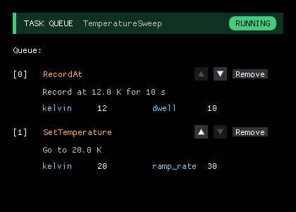
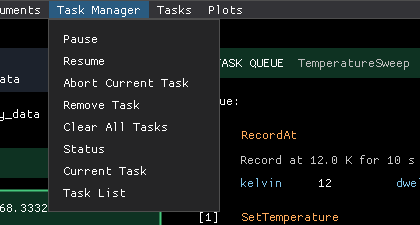
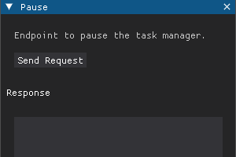
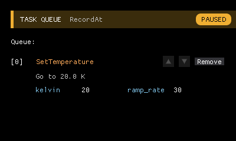
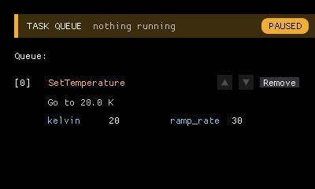

# 6. Running Tasks

<p class="pa-meta" markdown="span">About 8 minutes · Needs [lesson 5](building_a_sweep.md)</p>

A long procedure needs supervising. In this lesson you will queue several tasks to run one after another, change your mind about the order, and pause and abort a task safely. There is no new code: the experiment from the last lesson is all you need.

## The queue

The task manager runs one task at a time, in the order they were added. Add another while one is running and it waits its turn.

Run your experiment, then start a short sweep (`low` `4`, `high` `8`, `step` `4`, `dwell` `10`) from **Tasks → Temperature Sweep**, or with the **+** card at the bottom of the queue, which lists the tasks you can add. While it runs, add two more: **Record At** with `kelvin` `12` and `dwell` `10`, then **Set Temperature** with `kelvin` `20` and `ramp_rate` `30`.

{ .pa-shot .pa-medium }

The **Task Queue** shows the task that is running in its header, and in a card under it with its `description` and `parameters`, and **Pause** and **Abort** buttons. Behind it, in order, are the tasks that are waiting. Each waiting task is a small grey card with a lighter grey edge, showing its place in the queue, its name, and the `description` and `parameters` that you wrote in [lesson 4](first_task.md), which is why they are worth writing. The arrows on a card move it up or down the queue, and **Remove** takes it out.

Each waiting task has two arrows and a **Remove** button:

- **Remove** takes it out of the queue.
- **The arrows** move it one place up (so it runs sooner) or down. The first task cannot move up, because the place in front of it belongs to the task that is running, and the last cannot move down. Those arrows are greyed out.

The queue does not have to be full at the start. A task added to an empty queue starts at once, and you can keep adding to a queue while it runs, which is how you set up a long series of runs to carry on unattended.

## Pause, resume and abort

The **Task Manager** menu controls what is running.

{ .pa-shot .pa-small }

Like every other menu item, each of these opens a small window with a **Send Request** button. Choose **Pause**, and press it.

{ .pa-shot .pa-small }

The header turns amber and reads **PAUSED**.

{ .pa-shot .pa-small }

The running task has stopped at its next wait, with the instruments left as they were (unless the task says otherwise: a task that controls a magnet, say, can put it on hold when it is paused, as [Writing tasks](tasks.md#pausing-hardware-on_pause-and-on_resume) explains), and no new task will start. Measuring carries on: **Live Data** and the data file do not stop when a task does. (To pause measuring, use the **Rack** menu.) Choose **Resume** to carry on from where the task stopped.

**Abort Current Task** stops the running task for good. It stops wherever it is waiting, even in the middle of a long wait, and then its `teardown()` runs. **This is why `teardown()` matters.** Abort a `SetTemperature` in the middle of a ramp, and the code you wrote in [lesson 4](first_task.md) sets the setpoint to the temperature the sample has reached, so the cryostat settles where it is, instead of carrying on towards a target that nobody wants any more.

{ .pa-shot .pa-small }

Notice what the queue does next. **An abort pauses the whole queue**, so that the next task does not start on its own straight after you have interrupted something. When you are ready, choose **Resume**, and the next task starts.

!!! tip "Try it"
    Queue a sweep and let it start ramping. Choose **Abort Current Task**, send it, and watch `T` in **Live Data**. It settles near where it was when you aborted, rather than continuing to the target. Then choose **Resume** to let the next task in the queue begin.

## Drive it from a script

The interface is one client of a small web API that the experiment serves while it runs, and anything you can do from a menu you can do from a script. Every task appears at `/tasks/` followed by its `label`, in lower case with underscores. Every input is given as a query parameter, and every input must be given:

```python
import requests

base = "http://localhost:8000"

requests.get(
    f"{base}/tasks/temperature_sweep",
    params={"low": 4, "high": 20, "step": 4, "dwell": 10},
)
```

Open [http://localhost:8000/docs](http://localhost:8000/docs) while the experiment is running for an interactive page that lists every address and its inputs. A script like this can queue a whole series of experiments, wait for them, analyse the files and decide what to queue next. The [Running tasks](running_tasks.md#running-tasks-from-a-script) page shows how to wait until the queue is empty.

## More than one queue

One task manager runs its tasks one after another. For work that must carry on *while* the queue does something else, such as a control loop that holds a temperature for the whole experiment, add another task manager: each has its own queue, and they run at the same time. That is a topic of its own, covered in [Running tasks](running_tasks.md#several-task-managers).

!!! success "Checkpoint"
    You can queue several tasks and see them wait in the **Task Queue**, reorder or remove a waiting one, pause and resume, and abort a running task and see the queue pause behind it.

## What you learned

- Tasks queue up and run one at a time. Waiting tasks can be reordered and removed.
- **Pause** holds a task at its next wait. **Resume** carries on. **Abort** stops it, runs `teardown()`, and pauses the queue. So does a task that fails.
- A good `teardown()` is what makes it safe to interrupt a procedure.
- The interface is one client of a local API, so a script can run the same tasks.

Next: [swap the simulated rig for real instruments](real_instruments.md).
