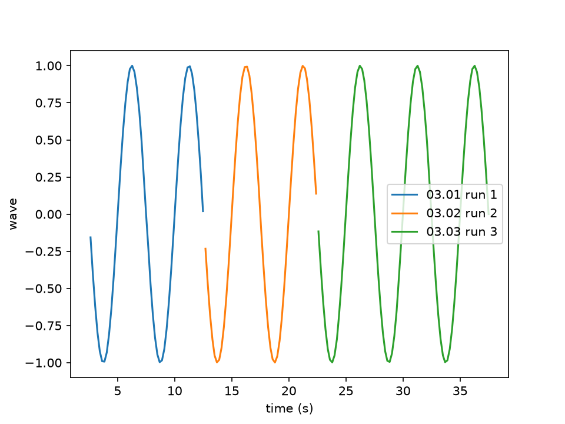

# Read your data

<p class="pa-meta" markdown="span">About 10 minutes · Needs [Getting Started](../getting_started/python_api.md), and matplotlib (`uv add matplotlib`)</p>

Everything an experiment measures is saved in its data files, as it is measured. In this tutorial you read them back for analysis. You find the files, read one into pandas, plot one column against another, and read every file of a run together, to plot them as one figure. Then you let the interface write a plotting script for you.

It starts where [2. The Python API](../getting_started/python_api.md) ends: your `my-lab` project, with the data from its runs in `data`. You write `analyse.py` beside it.

<div class="gs" data-files="analyse.py:versions" data-lines="18" data-term-lines="9" markdown>

<div class="gs-stage" markdown>

<div class="gs-notes" markdown>

<section class="gs-step" data-new-file markdown>

## Find the data files

```python title="analyse.py"
--8<-- "examples/usage/read_data/analyse_1.py"
```

```bash
uv run analyse.py
```

```text
00.00 start.data
01.00 start.data
02.00 start.data
03.00 start.data
03.01 run 1.data
03.02 run 2.data
03.03 run 3.data
```

Every run of the experiment writes to `data`, in `my-lab`, and a file's name says where it belongs. `03.01 run 1.data` is the first new file (`.01`) of the fourth run (`03.`), titled `run 1`. A run's first file is `.00 start`, and each new file takes the next number, so none is ever written over.

`Path.glob` lists the files that match a pattern, and `sorted` puts them in order. Yours are your own runs: these come from doing each step of Getting Started once.

**More:** [data files' names](../reference/data_files.md#file-names), and [`pathlib`](https://docs.python.org/3/library/pathlib.html).
{ .gs-more }

</section>

<section class="gs-step" markdown>

## Read a file with pandas

```python title="analyse.py" hl_lines="3 6-7"
--8<-- "examples/usage/read_data/analyse_2.py"
```

```bash
uv run analyse.py
```

```text
       time      wave     power
0  2.626775 -0.156434  0.024472
1  2.827687 -0.400605  0.160484
2  3.032861 -0.618847  0.382972
3  3.235366 -0.797036  0.635267
4  3.439124 -0.923639  0.853109
```

A data file is plain CSV: a header of column names, then a row for each cycle. `pd.read_csv` reads it into a table, a `DataFrame`, and `head()` shows its first five rows. pandas comes with PyAcquisition, so there is nothing to install.

`time` is the clock's: seconds since the experiment started. So `run 1`, begun a few seconds into its run, starts at 2.6.

**More:** [what is in a data file](../reference/data_files.md), and [`pandas.read_csv`](https://pandas.pydata.org/docs/reference/api/pandas.read_csv.html).
{ .gs-more }

</section>

<section class="gs-step" markdown>

## Plot a column against another

```python title="analyse.py" hl_lines="3 10-13"
--8<-- "examples/usage/read_data/analyse_3.py"
```

```bash
uv add matplotlib
uv run analyse.py
```

matplotlib draws plots, and doesn't come with PyAcquisition, so `uv add matplotlib` adds it to the project. `plt.plot` draws one column against another, each picked by its name, as in `run["wave"]`. `plt.show()` opens a window with the plot, and the script waits for you to close it.

**More:** [matplotlib's tutorials](https://matplotlib.org/stable/tutorials/index.html).
{ .gs-more }

</section>

<section class="gs-step" markdown>

## Read every file of a run

```python title="analyse.py" hl_lines="7-10 14-15"
--8<-- "examples/usage/read_data/analyse_4.py"
```

```bash
uv run analyse.py
```

```text
03.01 run 1: 50 rows, from 2.6 s
03.02 run 2: 49 rows, from 12.7 s
03.03 run 3: 75 rows, from 22.6 s
```

A run's stages are in files of their own, and a pattern picks them: `03.* run *.data` is every file of the fourth run titled `run …`. The loop reads each, says how long it is, and plots it with its name as its label, so the legend says which is which. `plt.savefig` keeps the figure as `wave.png`, beside the script.

`run 3` is longer, since recording goes on into it until the experiment stops. Change `03` to the run you want.

**More:** [`Path.glob`](https://docs.python.org/3/library/pathlib.html#pathlib.Path.glob), and [`NewFile`](../reference/tasks/new_file.md), the task that starts each file.
{ .gs-more }

</section>

<section class="gs-step" markdown>

## Let the interface write the script

```bash
uv run lab.py
uv run "04.00 start - wave vs time.py"
```

The interface writes a script like this for any plot. Run the experiment, and on the plot press the export button, then **Python script (matplotlib)**. **Save…** asks where to put it, with a name made from the data file and the plot, such as `04.00 start - wave vs time.py`: save it in `my-lab`. It reads the data files where they are, draws the same columns, labels and colours, and is yours to change.

**Publication figure (APS style)** writes one for a paper instead: a figure one journal column wide, saved as a PDF.

**More:** [the plots, and their export](../reference/interface.md#the-plots).
{ .gs-more }

</section>

</div>

</div>

</div>

## What you built

The figure `analyse.py` draws, and saves as `wave.png`:

<div class="gs-shot" markdown>

{ .pa-shot }

</div>

!!! success "Checkpoint"
    `uv run analyse.py` prints a line for each of `run 1`, `run 2` and `run 3`, and a window shows `wave` against time, in a colour for each file, saved as `wave.png`. The script the interface wrote draws the plot you exported.

??? failure "Something not working?"
    - **`FileNotFoundError: [Errno 2] No such file or directory: 'data\\03.01 run 1.data'`.** Your files are numbered differently, or the terminal isn't in `my-lab`. Use a name that step 1 printed.
    - **`pandas.errors.EmptyDataError: No columns to parse from file`.** The file has no columns: `00.00 start.data` is from Getting Started's empty file, which measured nothing. Read another.
    - **`KeyError: 'power'`.** That file has no `power` column: the files from before `lab.py` added the calculation don't. `print(run.columns)` lists a file's columns.
    - **`ModuleNotFoundError: No module named 'matplotlib'`.** Run `uv add matplotlib` in `my-lab`.
    - **Step 4 prints nothing, and the plot is empty.** No file matched the pattern: your **Record** run is in another block (`04.`, say), or the terminal isn't in `my-lab`.

## What you learned

- Data files are in `data`, named by run, file and title: `03.01 run 1.data`. Each run and each new file takes the next number.
- Each is plain CSV, with a header of column names, which `pd.read_csv` reads into a `DataFrame`.
- `Path.glob` finds a run's files, to read and plot together.
- A plot's export writes a matplotlib script of what it shows, or a figure for a paper.

Next: [Calculate new columns](calculations.md) works out columns as you record, so that there is less to do afterwards.
