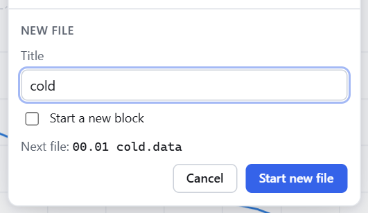

# 3. Recording Data

<p class="pa-meta" markdown="span">About 8 minutes · Needs [lesson 2](simulated_rig.md)</p>

In this lesson you will learn how `pyacquisition` names and organises your data files, start a new file from the interface, read your data back in Python, and add a calculated column.

## Where the data goes

Every measurement cycle (four a second, unless you change `measurement_period`) writes one row to the current data file. Each file is comma separated text, with a header row of measurement names:

```
time,T,x,y
47.891117095947266,20.004272338647684,1.1351878629106635e-05,7.014072038616088e-07
48.13974905014038,20.000104851436728,1.1844841632459187e-05,-8.392806985024337e-06
```

Files are named `<block>.<step> <title>.data`, for example `00.01 cold.data`:

| Part | Meaning |
|---|---|
| **block** | Groups the files of one run. Each time you run the experiment a new block starts, so files from earlier runs are never overwritten. |
| **step** | Counts the files within a block, starting at `00`. |
| **title** | A label you choose when you start a new file. The first file of a run is always called `start`. |

Recording each stage of an experiment (a sweep, a cooldown, one condition) into its own file makes analysis far easier than cutting one enormous file apart afterwards. So let's start a new file.

## Start a new file

Run the experiment from the last lesson. Then click the file name in the top bar, `00.00 start.data`. It shows the folder the files go in, and a form to start a new one.

Type `cold` as the **Title**, and leave **Start a new block** unticked. Under it, the form shows the name the file will get. Press **Start new file**.

{ .pa-shot .pa-small }

The top bar now reads `00.01 cold.data`, and from the next cycle onward, every row goes there. The plot starts afresh with the new file, and shows the file before it more faintly.

{ .pa-shot }

Look in `my_data`:

```
my_data/
├── 00.00 start.data
└── 00.01 cold.data
```

Tick **Start a new block** instead, and the new file would start a new block: `01.00 cold.data`. The `step` is for stages within one run, and the `block` is for runs.

You will not always want to click. In [lesson 5](building_a_sweep.md) a task starts a new file for you at the right moment.

## Add a calculation

Raw measurements are often not what you want to plot. A **calculation** makes new columns from the measurements, and saves them to the data file next to the raw values. Here we want the size of the lock-in's signal, `R`, from its two components:

<div class="pa-annot" data-source="examples/tutorial/step_3_recording_data.py" markdown>

<div class="pa-ide" markdown>

```python title="my_experiment.py" linenums="1" hl_lines="1 34"
--8<-- "examples/tutorial/step_3_recording_data.py"
```

</div>

<div class="pa-annot__notes" markdown="0">
<div class="pa-note" style="--from: 1; --to: 1" data-contains="import math"><b>One new import</b><span><code>math.hypot(x, y)</code> is the length of a vector.</span></div>
<div class="pa-note" style="--from: 34; --to: 34" data-contains="add_calculation"><b>Add a calculation</b><span>A function from a row of values to new columns. The raw columns are always kept.</span></div>
</div>

</div>

A calculation is a function that takes a **row** (a dictionary of column name to value) and returns a dictionary of new columns. For a line or two, a `lambda` is fine. The raw columns are always kept.

Run it again and look at the top of the new data file:

```
time,T,x,y,R
47.891117095947266,20.004272338647684,1.1351878629106635e-05,7.014072038616088e-07,1.1373527178302996e-05
```

There is a new `R` column. It is in the interface too: `R` has a tile in the **Values** tab, and can be plotted like any measurement.

!!! note "More calculations"
    Calculations that need to remember earlier rows (a rolling average, say) are covered in [Calculations](calculations.md).

## Read your data in Python

The files are plain CSV, so anything can read them. `pandas` is installed alongside `pyacquisition`:

```python
import pandas as pd

data = pd.read_csv("my_data/00.01 cold.data")
print(data[["T", "x", "R"]].describe())
```

`describe()` prints the count, mean, spread and range of each column. Notice the file name has a space in it, so keep the quotes.

!!! success "Checkpoint"
    `my_data` holds a `00.00 start.data` and a `00.01 cold.data`, and the second has the columns `time`, `T`, `x`, `y` and `R`.

## What you learned

- Data goes to files named `<block>.<step> <title>.data`. A new **block** starts with each run, and a new **step** with each file.
- The file name in the top bar starts a new file, and tasks can do it too.
- A **calculation** adds columns to the file without touching the raw data.
- Files are plain CSV: read them with `pandas` or anything else.

There is more about file names, slow queries and failing measurements in [Measurements and data files](measurements.md).

Next: [automate something with a task](first_task.md).
