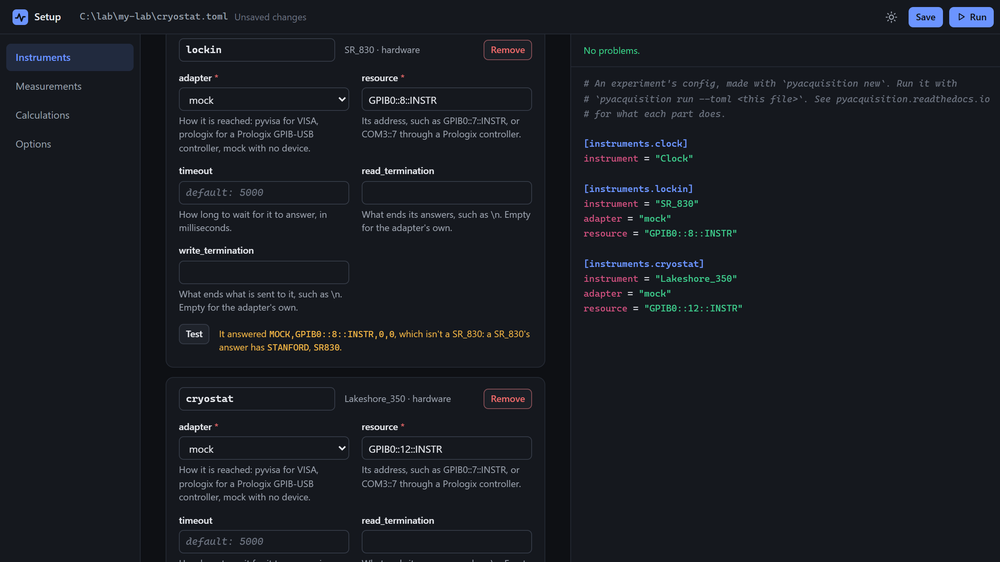
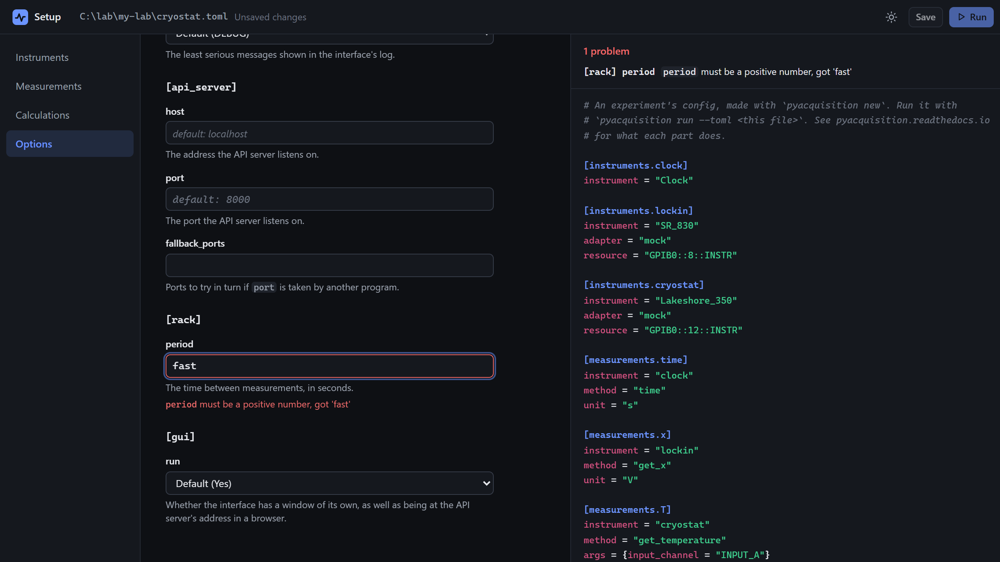
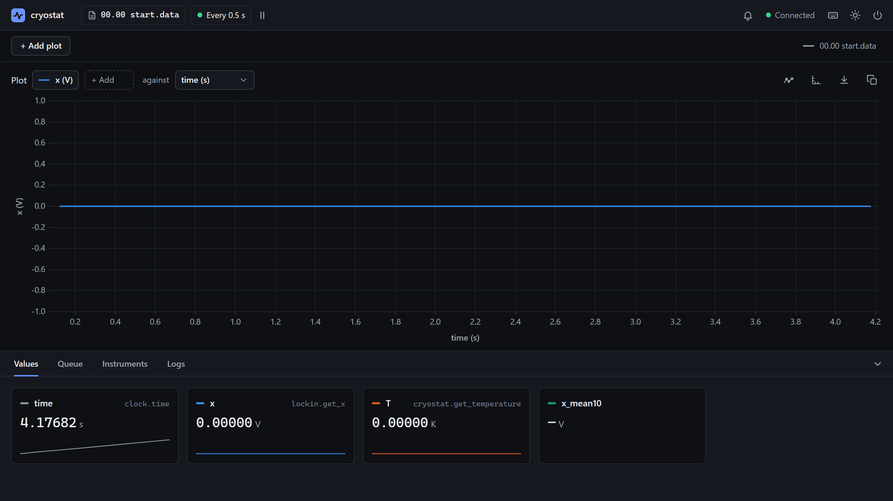

# Build a config in the interface

<p class="pa-meta" markdown="span">About 10 minutes · Needs [0. Installation](../getting_started/installation.md). [1. The Config File](../getting_started/config_file.md) helps</p>

A config file describes a whole experiment: its instruments, what it measures, its calculations and its options. `pyacquisition new` writes one from forms, in a window, and checks it as you go, so it runs the first time. In this tutorial you build one for a common rig, a lock-in and a temperature controller on a cryostat, and run it from the same window.

You work in your `my-lab` project, and make `cryostat.toml`. The instruments are on `mock`, so it runs with no hardware. With yours connected, give their real adapters and addresses instead.

<div class="gs" data-files="cryostat.toml:versions" data-lines="24" data-term-lines="3" markdown>

<div class="gs-stage" markdown>

<div class="gs-notes" markdown>

<section class="gs-step" data-result="[Setup] The setup page is at http://localhost:8000/ui/setup/" markdown>

## Open the setup page

```bash
uv run pyacquisition new cryostat.toml
```

The setup page opens in a window. Its sections are down the left, **Instruments**, **Measurements**, **Calculations** and **Options**, and on the right is the file as it will be written, checked as it changes. `cryostat.toml` doesn't exist yet: it is made when you first **Save**. An existing file opens to change, and keeps its comments and order.

If port 8000 is taken, give another: `--port 8001`.

**More:** [`pyacquisition new`](../reference/command_line.md).
{ .gs-more }

</section>

<section class="gs-step" data-new-file markdown>

## Add the instruments

```toml title="cryostat.toml"
--8<-- "examples/usage/setup_page/cryostat_1.toml"
```

**Add instrument** asks for a driver (type to search) and a name: `Clock` as `clock`, `SR_830` as `lockin`, and `Lakeshore_350` as `cryostat`. A hardware one also needs an **adapter** and a **resource**: `mock` and `GPIB0::8::INSTR` for the lock-in, `mock` and `GPIB0::12::INSTR` for the controller. Then **Save**. This is the file it writes.

**Test** asks an instrument who it is. On `mock`, the lock-in says `It answered MOCK,GPIB0::8::INSTR,0,0, which isn't a SR_830`: a real one's answer names it.

**More:** [the `[instruments]` table](../reference/config_file.md#instruments), and [Connect a real instrument](connect_instrument.md), for an address.
{ .gs-more }

</section>

<section class="gs-step" markdown>

## Add the measurements

```toml title="cryostat.toml"
--8<-- "examples/usage/setup_page/cryostat_2.toml"
```

In **Measurements**, **Add measurement** asks for an instrument, one of its driver's queries, and a name: `clock`'s `time` as `time`, `lockin`'s `get_x` as `x`, and `cryostat`'s `get_temperature` as `T`. A query with an argument gets a field for it, with its choices: **Input A** for `T`. Give each a **unit**, `s`, `V` and `K`.

The arrows move a measurement up or down: their order is the columns' order in the data file.

**More:** [the `[measurements]` table](../reference/config_file.md#measurements).
{ .gs-more }

</section>

<section class="gs-step" markdown>

## Add a calculation

```toml title="cryostat.toml"
--8<-- "examples/usage/setup_page/cryostat_3.toml"
```

In **Calculations**, **Add calculation** makes a new column from those above it. `RollingMean`, named `x_mean10`, averages `x`'s last 10 values, and `Sum` adds columns up. These two are what a file can hold: anything else is written in Python.

**More:** [Calculations](../reference/calculations.md), and [Calculate new columns](calculations.md).
{ .gs-more }

</section>

<section class="gs-step" markdown>

## Set the options

```toml title="cryostat.toml"
--8<-- "examples/usage/setup_page/cryostat_4.toml"
```

**Options** has a field for every option, grouped by the table of the file it goes in, each with what it does and its default. Set `[rack]` **period** to 0.5, and `[logging]` **console_level** to `INFO`. Only the options you set are written, so the file stays short.

**More:** [Experiment options](../reference/experiment_options.md), and [Set the experiment's options](options.md).
{ .gs-more }

</section>

<section class="gs-step" markdown>

## Fix a problem the page shows

Type `fast` for **period**. At once the page shows **1 problem**, `[rack] period` with `period must be a positive number, got 'fast'`, above the file and under the field, and **Save** is disabled: the page never writes a file that wouldn't run.

Put 0.5 back, and the problem goes. Every field is checked this way, without contacting any instrument.

**More:** [mistakes in a config file](../reference/config_file.md#mistakes-in-the-file).
{ .gs-more }

</section>

<section class="gs-step" markdown>

## Run it from the page

**Run** saves the file if there is anything unsaved, and starts the experiment from it, in the same window, as `uv run pyacquisition run --toml cryostat.toml` would. The top bar says `cryostat` and **Every 0.5 s**, and the tiles are `time`, `x`, `T` and `x_mean10`, with their units.

To change the file afterwards, close the experiment and open the setup page again: a running experiment can't take on new instruments.

??? tip "Adding Python"
    The page writes files. Your own tasks and calculations are Python, in a class that reads the file:

    ```python
    class Cryostat(Experiment):
        def setup(self):
            self.register_task(SetTemperature, label="Set Temperature")


    if __name__ == "__main__":
        Cryostat.from_config("cryostat.toml").run()
    ```

**More:** [`pyacquisition run`](../reference/command_line.md), and [Write a task](write_task.md).
{ .gs-more }

</section>

</div>

</div>

</div>

## What you built

The setup page, with the instruments added and the lock-in tested on `mock`:

{ .pa-shot }

A problem, shown by its field and above the file, with **Save** disabled:

{ .pa-shot }

And the experiment that **Run** starts from it:

{ .pa-shot }

!!! success "Checkpoint"
    `cryostat.toml` on disk is the file the page shows, with the three instruments, three measurements, the rolling mean, `[rack] period = 0.5` and `[logging] console_level = "INFO"`. **Run** starts it in the same window, as `cryostat`, every 0.5 s.

??? failure "Something not working?"
    - **The window doesn't open, and the terminal says `The API server can't listen on localhost: every port it may use is taken: 8000`.** Something else has port 8000, often another experiment. Give another with `--port 8001`.
    - **Save is disabled.** The page lists a problem, above the file and under its field: fix it, and **Save** comes back.
    - **Test says the instrument isn't the one its driver is for.** On `mock`, that is expected. With hardware, the address is another instrument's: check it with [`list_resources()`](connect_instrument.md#find-the-instruments-address).

## What you learned

- `pyacquisition new` writes a config file from forms, and checks it as it changes, so a file it saves runs.
- **Test** asks an instrument at its address who it is, and says whether it is the one its driver is for.
- Measurements' order is the data file's columns' order, and only the options you set are written.
- **Run** starts the experiment from the file, in the same window.

Next: [Drive an experiment from a script](running.md), to run and control an experiment from your own code.
