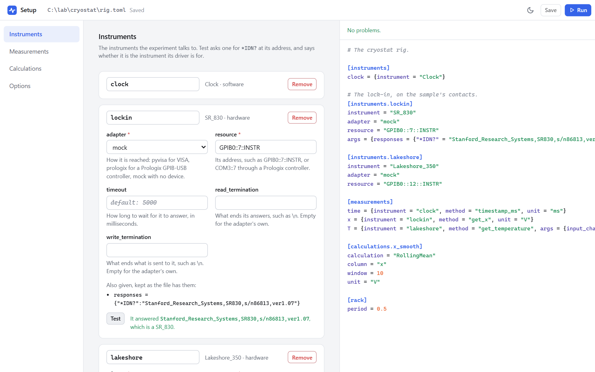
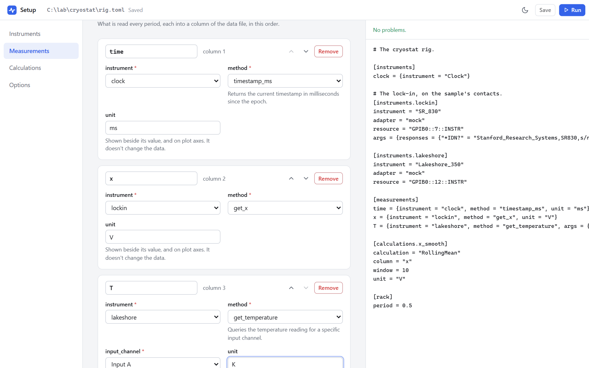
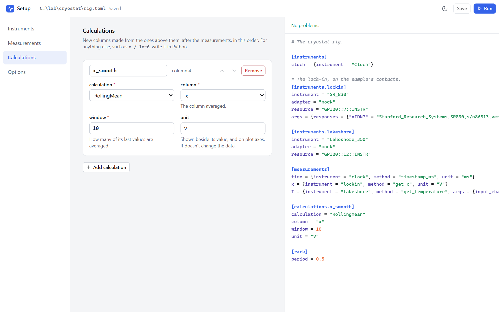
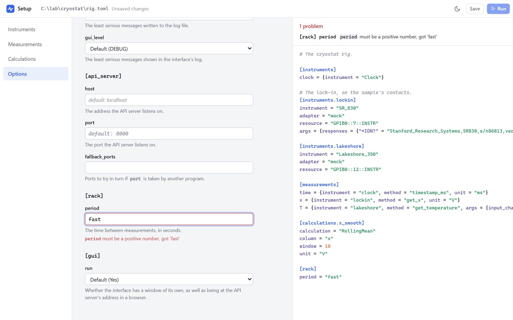

# Setting Up in the Interface

You can describe an experiment in a [TOML file](../reference/config_file.md) without writing it yourself. `pyacquisition new` opens a window in which you add the instruments, choose what to measure, add calculations and set the options, all from forms. The file it makes is shown beside them, checked as it changes, and saved when you say. **Run** then starts the experiment from it, in the same window.

```
uv run pyacquisition new rig.toml
```

If `rig.toml` exists, it is opened to change. If not, it is made when you first save. Either way, the file keeps what you wrote in it: its comments, its order and its layout. Only what you change is changed.

The window uses the port the file gives its experiment, or 8000. Give another with `--port`, for example if another experiment is running: `uv run pyacquisition new rig.toml --port 8001`. The experiment that **Run** starts uses the same port.

## The page

The sections are down the left: **Instruments**, **Measurements**, **Calculations** and **Options**. The one you pick is in the middle, and the file is on the right.

{ .pa-shot }

Every change is checked a moment after you make it, without contacting any instrument. Anything that would stop the file from running is listed above it, and shown under the field it belongs to. **Save** writes the file once there is nothing listed.

## Instruments

Each instrument has a name, which is how measurements and the interface refer to it, and a driver, such as `SR_830`. **Add instrument** asks for the driver (type to search the list) and a name.

An instrument with hardware also has:

- **adapter**: how it is reached. `pyvisa` for most instruments, `prologix` behind a Prologix GPIB-USB controller, and `mock` to run with no device at all (see [Running hardware instruments without the device](../reference/adapters.md#mock)).
- **resource**: its address, such as `GPIB0::7::INSTR`.
- **timeout**, **read_termination** and **write_termination**, which most instruments don't need. Type a line ending as `\n`.

Anything else in the instrument's `args` in the file is listed as it is, and kept.

**Test** asks the instrument at its address who it is (`*IDN?`), and says whether the answer is from the instrument its driver is for. It only asks: nothing is set up or changed on the instrument. A driver whose answer isn't known (the Mercury IPS) shows the answer without comparing it.

Renaming an instrument renames it in the measurements that use it too. Removing one that a measurement uses shows a problem by that measurement.

## Measurements

{ .pa-shot }

Each measurement is a column of the data file: an instrument, one of its driver's queries, which is called every period, and a unit, which is shown in the interface and doesn't change the data. A query that takes arguments, such as the Lakeshore's `get_temperature`, has a field for each, with its choices where there are some.

The arrows move a measurement up or down. Their order is the order of the columns in the data file.

## Calculations

{ .pa-shot }

The built-in [calculations](../reference/calculations.md#in-a-config-file) make new columns from the ones above them: `Sum` adds up the columns you tick, and `RollingMean` averages the last `window` values of a column. Only the measurements, and the calculations above one, can be its inputs, so moving it above a column it uses is a problem. Anything else, such as `x / 1e-6`, is written in Python (see below).

## Options

Every [experiment option](../reference/experiment_options.md) has a field, grouped by the section of the file it goes in, with what it is for. An empty field keeps the default, which it shows, and only the options you set are written to the file.

{ .pa-shot }

## Run

**Run** saves the file if there is anything to save, and starts the experiment from it, in the same window, as `uv run pyacquisition run --toml rig.toml` would. It waits until there are no problems. If the experiment can't start, the setup page comes back and says why.

To change the experiment afterwards, stop it and run `pyacquisition new rig.toml` again. An experiment can't take on new instruments or measurements while it runs.

## With Python

The page makes TOML files. The parts of an experiment that are Python, such as your own tasks and calculations, go in a subclass that reads the file, as in [Combining a config file with Python](../reference/experiment_options.md#where-a-value-comes-from):

```python
class MyExperiment(Experiment):
    def setup(self):
        self.register_task(TemperatureSweep)


if __name__ == "__main__":
    MyExperiment.from_config("rig.toml").run()
```

Set up the rig in `rig.toml` with `pyacquisition new`, and run the script as usual.
