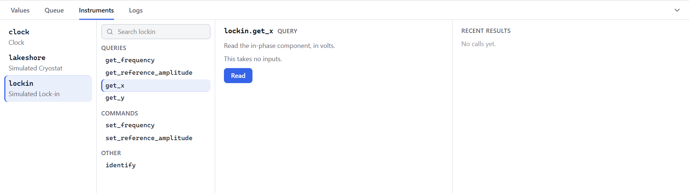

# 2. A Simulated Rig

<p class="pa-meta" markdown="span">About 10 minutes · Needs [lesson 1](first_experiment.md)</p>

In this lesson you will add a temperature controller and a lock-in amplifier to your experiment, record their readings, and drive the rig by hand from the interface. You will see the sample's signal collapse as it warms.

## Instruments, queries and commands

An **instrument** is a Python object that represents a device. It offers two kinds of function:

- **Queries** read something from the device: a temperature, a voltage, the time.
- **Commands** make the device do something: set a frequency, start a ramp.

Every query and command of every instrument appears in the interface automatically, and in your own code.

You do not need any hardware for this tutorial. The next file is a **simulated rig**: a temperature controller and a lock-in amplifier, written in Python, whose queries and commands have exactly the names and arguments of a real Lakeshore 350 and a real SR 830. The sample it measures loses its lock-in signal as it warms through 14 K.

Save this next to `my_experiment.py`, as `simulated.py`. You do not need to read it, and you will never need to change it:

??? example "simulated.py"

    ```python title="simulated.py" linenums="1"
    --8<-- "examples/tutorial/simulated.py"
    ```

!!! tip "Why simulate?"
    Building and testing your whole experiment against a stand-in is much safer and quicker than doing it on real hardware. Because the stand-in has the same queries and commands as the real thing, [swapping it out later](real_instruments.md) is a two-line change.

## Add the instruments

Update `my_experiment.py`. The new lines are highlighted, with a note beside each:

<div class="pa-annot" data-source="examples/tutorial/step_2_simulated_rig.py" markdown>

<div class="pa-ide" markdown>

```python title="my_experiment.py" linenums="1" hl_lines="3-4 15-16 18-19 22-30"
--8<-- "examples/tutorial/step_2_simulated_rig.py"
```

</div>

<div class="pa-annot__notes" markdown="0">
<div class="pa-note" style="--from: 3; --to: 4" data-contains="SimulatedCryostat"><b>The stand-in rig</b><span>The instruments from <code>simulated.py</code>, and the enum that picks a sensor.</span></div>
<div class="pa-note" style="--from: 15; --to: 16" data-contains="SimulatedCryostat"><b>Add an instrument</b><span>An id, then <code>add_instrument</code>. The id names it in the interface, the API and your tasks.</span></div>
<div class="pa-note" style="--from: 18; --to: 19" data-contains="SimulatedLockin"><b>Tell it about the sample</b><span>This lock-in is told which cryostat holds its sample. A real one is simply wired to it.</span></div>
<div class="pa-note" style="--from: 22; --to: 30" data-contains="input_channel"><b>Add measurements</b><span>Any query, read every cycle. Give a query its arguments as keywords, like <code>input_channel</code>, which picks the sensor.</span></div>
</div>

</div>

Add instruments and measurements in `setup()`. Once the experiment is running, the set of instruments and measurements cannot change.

## Run it

```
uv run my_experiment.py
```

The **Values** tab now has a tile for each measurement: `time`, `T`, `x` and `y`. The temperature sits at 20 K, where the sample has lost its signal, so `x` and `y` are tiny.

## Talk to an instrument

Open the **Instruments** tab (or press ++3++). It lists every instrument down the left. Click **lockin**, and the next column lists everything it can do: its queries, its commands, and a few others.

{ .pa-shot }

Click **get_x**. Its form appears beside the list, with the function's description (this text is the function's docstring) and a box for each input it needs. `get_x` needs none, so press **Read**.

{ .pa-shot }

The reply appears in **Recent results**, at the right: the value of `x` right now, a few microvolts of noise, with the time and how long the call took. The copy button beside it copies it. Every call you make to an instrument is listed there, newest first.

## Drive the rig by hand

The interface is as good at *doing* things as reading them. Warm sample, cold sample: let's cross the transition yourself.

First tell the controller how fast to move. Click **lakeshore**, then **set_ramp**. Choose **Output 1** for `Output Channel` and **On** for `State`, type `60` into `Rate` (kelvin per minute), and press **Send**.

{ .pa-shot .pa-small }

!!! tip "The forms"
    An input marked with a red star must be filled in, and the form will not send until it is. An input with a default in the code starts at its default. Choices, such as the channel, are a list to pick from.

Now click **set_setpoint**, choose **Output 1**, type `4` into `Setpoint`, and press **Send**.

{ .pa-shot .pa-small }

Watch the **Values** tab (press ++1++). `T` falls from 20 K towards 4 K at one kelvin per second, and as it passes 14 K, `x` climbs from almost nothing to about 2.4 millivolts. When it has arrived, set the setpoint back to `20` and watch it all happen in reverse.

## Plot it

Numbers are hard to read, and the plot at the top shows `T` against `time` to begin with. Make it show what the sample is doing:

1. **Choose the horizontal axis.** Choose `T` in the plot's **against** list.
2. **Choose what is plotted.** Use **+ Add** to add `x`, then `y`, and click the **×** on the `T` chip to take it off.

{ .pa-shot }

There it is: `x` (orange) collapses as the sample warms through 14 K, while `y` (green) shows a peak. The plot keeps its axes fitted to the data as it arrives, and it holds the whole of the current file, so nothing scrolls away.

!!! tip "Getting the plot you want"
    Drag a box to zoom in, and double-click to see everything again. Hover over the plot to read the values at any point. **+ Add plot** puts another plot beside this one, with its own columns, for when you want `T` against `time` as well.

!!! success "Checkpoint"
    You can ask an instrument a question from the **Instruments** tab, change its state by sending a command, and see the effect in the **Values** tab and on a plot. `x` is about 2.4 mV when `T` is 4 K, and about zero at 20 K.

## What you learned

- **Instruments** have **queries** (read) and **commands** (do), and all of them appear in the **Instruments** tab.
- A **measurement** takes a query, plus any arguments it needs as keywords, and records it on every cycle.
- Pick a query or command, fill in its form, and press **Read** or **Send**. The answers are kept beside the form.
- The simulated instruments have the same interface as the real ones, so nothing you write here is throwaway.

To go deeper on instruments, see [Adding instruments](instruments.md) and [Writing your own instrument](custom_instruments.md).

Next: [recording data](recording_data.md).
