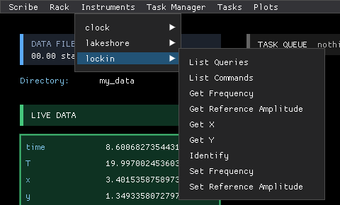
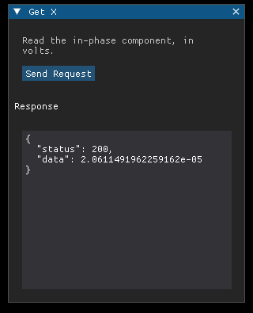
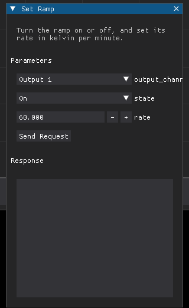
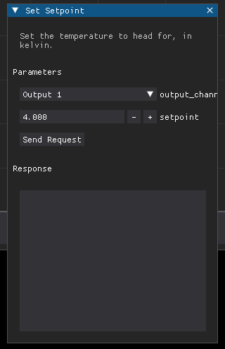
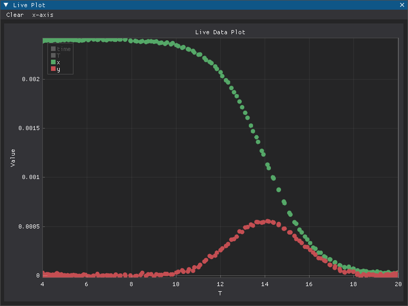

# 2. A Simulated Rig

<p class="pa-meta" markdown="span">About 10 minutes · Needs [lesson 1](first_experiment.md)</p>

In this lesson you will add a temperature controller and a lock-in amplifier to your experiment, record their readings, and drive the rig by hand from the interface. You will see the sample's signal collapse as it warms.

## Instruments, queries and commands

An **instrument** is a Python object that represents a device. It offers two kinds of function:

- **Queries** read something from the device: a temperature, a voltage, the time.
- **Commands** make the device do something: set a frequency, start a ramp.

Every query and command of every instrument appears in the interface automatically, and in your own code.

You do not need any hardware for this tutorial. The next file is a **simulated rig**: a temperature controller and a lock-in amplifier, written in Python, whose queries and commands have exactly the names and arguments of a real Lakeshore 350 and a real SR 830. The sample it measures loses its lock-in signal as it warms through 14 K.

Save this next to `my_experiment.py`, as `simulated.py`. You do not need to read it, and you will never need to change it:

??? example "simulated.py"

    ```python title="simulated.py" linenums="1"
    --8<-- "examples/tutorial/simulated.py"
    ```

!!! tip "Why simulate?"
    Building and testing your whole experiment against a stand-in is much safer and quicker than doing it on real hardware. Because the stand-in has the same queries and commands as the real thing, [swapping it out later](real_instruments.md) is a two-line change.

## Add the instruments

Update `my_experiment.py`. The new lines are highlighted, with a note beside each:

<div class="pa-annot" data-source="examples/tutorial/step_2_simulated_rig.py" markdown>

<div class="pa-ide" markdown>

```python title="my_experiment.py" linenums="1" hl_lines="3-4 15-16 18-19 22-30"
--8<-- "examples/tutorial/step_2_simulated_rig.py"
```

</div>

<div class="pa-annot__notes" markdown="0">
<div class="pa-note" style="--from: 3; --to: 4" data-contains="SimulatedCryostat"><b>The stand-in rig</b><span>The instruments from <code>simulated.py</code>, and the enum that picks a sensor.</span></div>
<div class="pa-note" style="--from: 15; --to: 16" data-contains="SimulatedCryostat"><b>Add an instrument</b><span>An id, then <code>add_instrument</code>. The id names it in the menus, the API and your tasks.</span></div>
<div class="pa-note" style="--from: 18; --to: 19" data-contains="SimulatedLockin"><b>Tell it about the sample</b><span>This lock-in is told which cryostat holds its sample. A real one is simply wired to it.</span></div>
<div class="pa-note" style="--from: 22; --to: 30" data-contains="input_channel"><b>Add measurements</b><span>Any query, read every cycle. Give a query its arguments as keywords, like <code>input_channel</code>, which picks the sensor.</span></div>
</div>

</div>

Add instruments and measurements in `setup()`. Once the experiment is running, the set of instruments and measurements cannot change.

## Run it

```
uv run my_experiment.py
```

**Live Data** now has a row for each measurement: `time`, `T`, `x` and `y`. The temperature sits at 20 K, where the sample has lost its signal, so `x` and `y` are tiny.

## Talk to an instrument

Open the **Instruments** menu. There is a submenu for each instrument, and each lists everything it can do.

{ .pa-shot .pa-medium }

Choose **lockin → Get X**. Every menu item opens a small window that describes the function (this text is the function's docstring), has a box for each input it needs, and a **Send Request** button. Press it.

{ .pa-shot .pa-small }

The reply appears in the window: a `status` of `200` (success) and the `data`. That is the value of `x` right now, a few microvolts of noise.

Every window opens in the top left corner, over the panes. Drag its title bar to move it out of the way, and close it with the **x**.

## Drive the rig by hand

The interface is as good at *doing* things as reading them. Warm sample, cold sample: let's cross the transition yourself.

First tell the controller how fast to move. Choose **Instruments → lakeshore → Set Ramp**, set `state` to **On** and `rate` to `60` (kelvin per minute), and press **Send Request**.

{ .pa-shot .pa-small }

!!! warning "Fill in every input"
    The boxes in these windows always start at zero (or empty), whatever default the code has. If you press **Send Request** with `rate` left at `0`, that is what is sent.

Now choose **lakeshore → Set Setpoint**, type `4` into `setpoint`, and press **Send Request**.

{ .pa-shot .pa-small }

Watch **Live Data**. `T` falls from 20 K towards 4 K at one kelvin per second, and as it passes 14 K, `x` climbs from almost nothing to about 2.4 millivolts. When it has arrived, set the setpoint back to `20` and watch it all happen in reverse.

## Plot it

Numbers are hard to read, so choose **Plots → New Plot**. A plot window opens, and it draws *every* measurement against the first one, on a single scale. That is rarely what you want, so give it three instructions:

1. **Choose the horizontal axis.** Open the plot's **x-axis** menu and choose `T`.
2. **Hide what you do not want.** Click a name in the plot's legend to hide or show that series. Hide `time` and `T`, so that only `x` and `y` remain.
3. **Fit the axes.** Double-click inside the plot and it rescales to what is visible.

{ .pa-shot }

There it is: `x` (green) collapses as the sample warms through 14 K, while `y` (red) shows a peak. Each dot is one measurement cycle. **Clear** empties the plot, and you can open as many plots as you like.

!!! tip "Getting the plot you want"
    Those three gestures (choose the axis, hide series, double-click to fit) are all there is to the plots. Do them again whenever you open a new plot, or when new data drifts outside the view.

!!! success "Checkpoint"
    You can ask an instrument a question from the **Instruments** menu, change its state by sending a command, and see the effect in **Live Data** and on a plot. `x` is about 2.4 mV when `T` is 4 K, and about zero at 20 K.

## What you learned

- **Instruments** have **queries** (read) and **commands** (do), and all of them appear in the **Instruments** menu.
- A **measurement** takes a query, plus any arguments it needs as keywords, and records it on every cycle.
- Every menu item opens a request window. Fill in every input, then press **Send Request**.
- The simulated instruments have the same interface as the real ones, so nothing you write here is throwaway.

To go deeper on instruments, see [Adding instruments](instruments.md) and [Writing your own instrument](custom_instruments.md).

Next: [recording data](recording_data.md).
