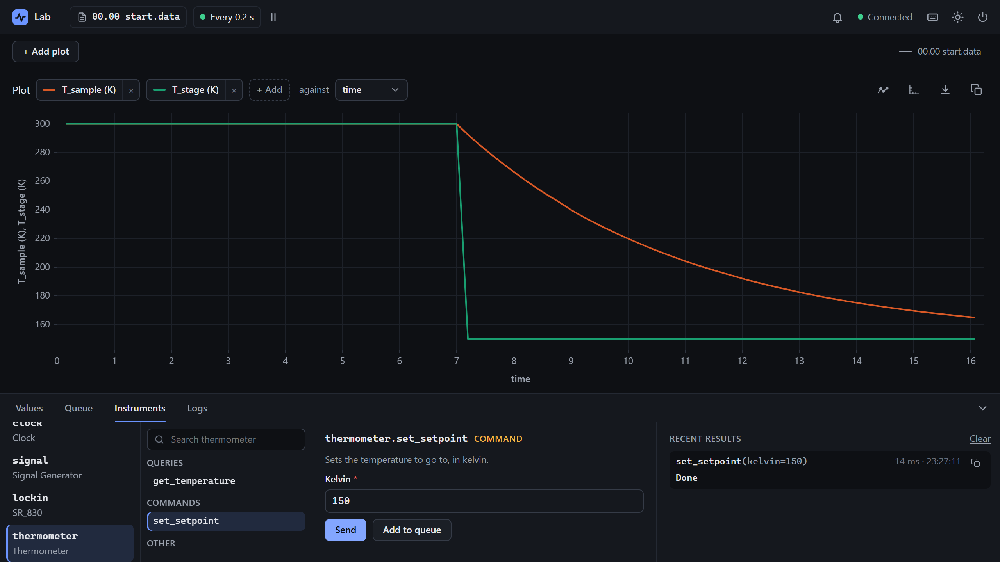

# Write a software instrument

<p class="pa-meta" markdown="span">About 15 minutes · Needs [Getting Started](../getting_started/python_api.md)</p>

A **driver** is the code that knows an instrument: what can be read from it, and what can be set. PyAcquisition comes with [several](../reference/instruments/overview.md), and yours can be a class with a few marked methods. A driver for a *software* instrument talks to no hardware. It is how to simulate an instrument you haven't got yet, or to put code of your own in the interface. In this tutorial you write one: a thermometer, simulated, whose sample follows a setpoint, with a reading, a setting, and a choice of sensor.

It starts where [2. The Python API](../getting_started/python_api.md) ends: your `my-lab` project, with `rig.toml` and `lab.py`. You write `thermometer.py` beside them, a few lines at a time, then add the thermometer to `lab.py`, and try it in the interface.

<div class="gs" data-files="lab.py:versions thermometer.py:versions" data-lines="22" data-term-lines="3" markdown>

<div class="gs-stage" markdown>

<div class="gs-notes" markdown>

<section class="gs-step" data-given markdown>

## Start from the Getting Started lab

```python title="lab.py"
--8<-- "examples/usage/software_instrument/lab_1.py"
```

This is `lab.py` as [2. The Python API](../getting_started/python_api.md) left it: an experiment of your own made from `rig.toml`, with a calculation, the `Record` task, and the lock-in's setup and teardown.

You add an instrument to it, from a driver you write yourself in `thermometer.py`, beside it.

**More:** [2. The Python API](../getting_started/python_api.md), which builds it.
{ .gs-more }

</section>

<section class="gs-step" data-new-file="thermometer.py" markdown>

## Start a driver class

```python title="thermometer.py"
--8<-- "examples/usage/software_instrument/thermometer_1.py"
```

A driver is a class. `SoftwareInstrument` is the base of one with no hardware behind it.

`name` is what the interface calls this kind of instrument: under an instrument's own name, `thermometer`, the **Instruments** tab shows **Thermometer**. The docstring says what the driver is, for whoever reads the code next.

**More:** [`SoftwareInstrument`](../reference/python_api/instrument.md#pyacquisition.core.instrument.SoftwareInstrument), and [the drivers that come with PyAcquisition](../reference/instruments/overview.md).
{ .gs-more }

</section>

<section class="gs-step" markdown>

## Add a query: the temperature

```python title="thermometer.py" hl_lines="1 9-16"
--8<-- "examples/usage/software_instrument/thermometer_2.py"
```

A **query** reads a value. `@mark_query` makes the method one: the **Instruments** tab lists it under **Queries**, with its docstring as its description, and a measurement can record it. Its return type, `float`, says what it gives.

`__init__` takes the instrument's name and passes it on to `SoftwareInstrument`, then keeps the temperature on the instance: 300 K, to start.

**More:** [`mark_query`](../reference/python_api/instrument.md#pyacquisition.core.instrument.mark_query), and [`Measurement`](../reference/python_api/measurement.md).
{ .gs-more }

</section>

<section class="gs-step" markdown>

## Add a command: the setpoint

```python title="thermometer.py" hl_lines="1-5 16 21 24-27"
--8<-- "examples/usage/software_instrument/thermometer_3.py"
```

A **command** changes the instrument. `@mark_command` makes `set_setpoint` one, listed under **Commands**. It keeps the temperature to go to, and each reading now moves the temperature 5% of the way there, so that it follows the setpoint as the experiment polls it.

Give each argument a type, here `float`. The interface makes the argument's box from it, and checks what is typed there. The import grows, for `mark_command`.

**More:** [`mark_command`](../reference/python_api/instrument.md#pyacquisition.core.instrument.mark_command).
{ .gs-more }

</section>

<section class="gs-step" markdown>

## Add a choice: the sensors

```python title="thermometer.py" hl_lines="2 9-13"
--8<-- "examples/usage/software_instrument/thermometer_4.py"
```

Some arguments are one of a few **choices**: a channel, a range, a mode. A `BaseEnum` lists them. Each member is a code, which a real instrument would be sent, and a label, which the interface shows. The enum's docstring is shown beside the choice.

This thermometer has two sensors: one on the sample, and one on the stage the sample sits on.

**More:** [`BaseEnum`](../reference/python_api/instrument.md#pyacquisition.core.instrument.BaseEnum), and [the SR 830](../reference/instruments/sr_830.md), a driver with many choices.
{ .gs-more }

</section>

<section class="gs-step" markdown>

## Read either sensor

```python title="thermometer.py" hl_lines="27-30"
--8<-- "examples/usage/software_instrument/thermometer_5.py"
```

`get_temperature` now takes a `sensor`, whose type is the choice. So the interface offers **Sample** and **Stage** in a list, starting at the default, **Sample**, and code gives it a member, such as `Sensor.STAGE`.

The stage is held at the setpoint by its heater, and reads it at once. The sample follows, a reading at a time.

**More:** [`BaseEnum`](../reference/python_api/instrument.md#pyacquisition.core.instrument.BaseEnum), and [a choice in a config file](../reference/config_file.md#measurements), given as text.
{ .gs-more }

</section>

<section class="gs-step" markdown>

## Add it to the experiment

```python title="lab.py" hl_lines="3 5 31-40"
--8<-- "examples/usage/software_instrument/lab_2.py"
```

In `setup()`, the thermometer is made, called `thermometer`, and added with `add_instrument`. Two measurements then record it on every cycle, one for each sensor. A measurement takes the query itself, with no brackets, and the arguments to call it with: here, the sensor. `unit` is shown beside the values.

The imports, at the top, gain `Measurement`, and your driver and its choices from `thermometer.py`.

**More:** [`add_instrument`](../reference/python_api/experiment.md#pyacquisition.core.experiment.Experiment.add_instrument), and [`Measurement`](../reference/python_api/measurement.md).
{ .gs-more }

</section>

<section class="gs-step" data-result="thermometer is in the Instruments tab." markdown>

## Run the experiment

```bash
uv run lab.py
```

In the **Instruments** tab, `thermometer` is listed as **Thermometer**, with `get_temperature` under **Queries** and `set_setpoint` under **Commands**. `identify`, under **Other**, comes with every software instrument, and answers its name.

Plot `T_sample` and `T_stage` with **+ Add**. Then pick `set_setpoint`, give **Kelvin** 150, and press **Send**. The stage is at 150 K at once, and the sample follows, most of the way there within ten seconds.

**More:** [the Instruments tab](../reference/interface.md#the-dock), and [the plots](../reference/interface.md#the-plots).
{ .gs-more }

</section>

</div>

</div>

</div>

## What you built

Your driver, in the interface:

<div class="gs-shot" markdown>

{ .pa-shot }

<span class="gs-pin" style="--x: 12.0%; --y: 96.6%">1</span>
<span class="gs-pin" style="--x: 29.1%; --y: 92.8%">2</span>
<span class="gs-pin" style="--x: 53.7%; --y: 78.1%">3</span>
<span class="gs-pin" style="--x: 46.2%; --y: 21.2%">4</span>

</div>

<div class="gs-legend" markdown>

1. **Your instrument.** Its name, and its driver's `name` under it.
2. **Its queries and commands.** One for each marked method.
3. **A form for each.** The method's docstring, and a box for each argument, made from its type.
4. **The two sensors.** The stage steps to the setpoint, and the sample follows.

</div>

!!! success "Checkpoint"
    The **Instruments** tab lists `thermometer` as **Thermometer**. **Read** on `get_temperature` answers a temperature in kelvin, and **Send** on `set_setpoint`, with **Kelvin** 150, answers **Done**. `T_stage` is then 150 at once, and `T_sample` follows it there.

??? failure "Something not working?"
    - **`ModuleNotFoundError: No module named 'thermometer'`.** `thermometer.py` isn't beside `lab.py`, or the terminal is in another folder. Both belong in `my-lab`.
    - **The experiment stops as it starts, with `Task group terminated due to an error: 'Thermometer' object has no attribute '_uid'`.** `__init__` doesn't call `super().__init__(uid)`.
    - **The experiment stops as it starts, with `Task group terminated due to an error: 300.0 is not a callable object`.** A measurement was given the query's answer, `thermometer.get_temperature()`, instead of the query. Leave out the brackets.
    - **A method isn't in the Instruments tab.** It needs `@mark_query` or `@mark_command` on the line above it.

## What you learned

- A **driver** is a class. `SoftwareInstrument` is the base of one with no hardware, and `name` is what the interface calls its instrument.
- `@mark_query` marks a method that reads, and `@mark_command` one that changes the instrument. The interface lists both, with their docstrings, and makes each a form from its arguments' types.
- A `BaseEnum` gives an argument a list of choices, each a code and a label.
- In `setup()`, `add_instrument` adds the instrument, and a `Measurement` records a query, with its arguments.

Next: [Writing your own instrument](custom_instruments.md#a-hardware-instrument) drives a real device the same way, with `Instrument`.
