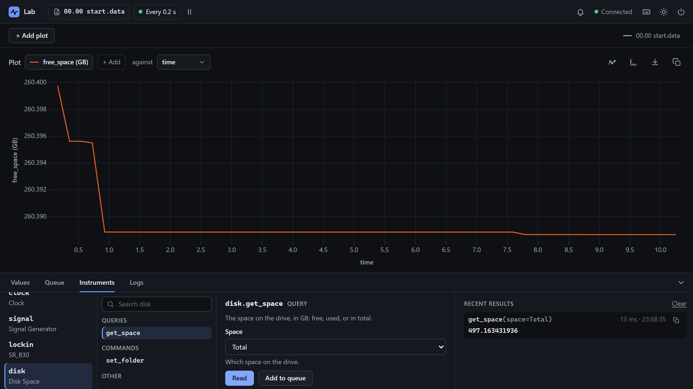

# Write a software instrument

<p class="pa-meta" markdown="span">About 15 minutes · Needs [Getting Started](../getting_started/python_api.md)</p>

A **driver** is the code that knows an instrument: what can be read from it, and what can be set. PyAcquisition comes with [several](../reference/instruments/overview.md), and yours can be a class with a few marked methods. A driver for a *software* instrument talks to no hardware. It reads or does something on the computer itself, and puts it in the interface and the data file beside everything else. In this tutorial you write one that watches the space left on the drive your data is written to, since a long run that fills the drive can't write any more.

It starts where [2. The Python API](../getting_started/python_api.md) ends: your `my-lab` project, with `rig.toml` and `lab.py`. You write `disk_space.py` beside them, a few lines at a time, then add the instrument to `lab.py`, and try it in the interface.

<div class="gs" data-files="lab.py:versions disk_space.py:versions" data-lines="22" data-term-lines="3" markdown>

<div class="gs-stage" markdown>

<div class="gs-notes" markdown>

<section class="gs-step" data-given markdown>

## Start from the Getting Started lab

```python title="lab.py"
--8<-- "examples/usage/software_instrument/lab_1.py"
```

This is `lab.py` as [2. The Python API](../getting_started/python_api.md) left it: an experiment of your own made from `rig.toml`, with a calculation, the `Record` task, and the lock-in's setup and teardown.

You add an instrument to it, from a driver you write yourself in `disk_space.py`, beside it.

**More:** [2. The Python API](../getting_started/python_api.md), which builds it.
{ .gs-more }

</section>

<section class="gs-step" data-new-file="disk_space.py" markdown>

## Start a driver class

```python title="disk_space.py"
--8<-- "examples/usage/software_instrument/disk_space_1.py"
```

A driver is a class. `SoftwareInstrument` is the base of one with no hardware behind it.

`name` is what the interface calls this kind of instrument: under an instrument's own name, `disk`, the **Instruments** tab shows **Disk Space**. The docstring says what the driver is, for whoever reads the code next.

**More:** [`SoftwareInstrument`](../reference/python_api/instrument.md#pyacquisition.core.instrument.SoftwareInstrument), and [the drivers that come with PyAcquisition](../reference/instruments/overview.md).
{ .gs-more }

</section>

<section class="gs-step" markdown>

## Add a query: the free space

```python title="disk_space.py" hl_lines="1 3 11-14"
--8<-- "examples/usage/software_instrument/disk_space_2.py"
```

A **query** reads a value. `@mark_query` makes the method one: the **Instruments** tab lists it under **Queries**, with its docstring as its description, and a measurement can record it. Its return type, `float`, says what it gives.

`shutil.disk_usage`, from Python's standard library, gives the space on the drive that a folder is on, in bytes. `"."` is the folder the experiment runs in, `my-lab`, where its data is written. Dividing by 10⁹ gives gigabytes.

**More:** [`mark_query`](../reference/python_api/instrument.md#pyacquisition.core.instrument.mark_query), and [`shutil.disk_usage`](https://docs.python.org/3/library/shutil.html#shutil.disk_usage).
{ .gs-more }

</section>

<section class="gs-step" markdown>

## Add a command: the folder to watch

```python title="disk_space.py" hl_lines="2 4-8 16-18 23 25-30"
--8<-- "examples/usage/software_instrument/disk_space_3.py"
```

A **command** changes the instrument. `@mark_command` makes `set_folder` one, listed under **Commands**. It changes the folder the query asks about, to watch another drive, such as one the data is copied to.

The folder is kept on the instance. `__init__` passes the instrument's name on to `SoftwareInstrument`, then starts the folder at `"."`. Give each argument a type, here `str`: the interface makes the argument's box from it. A folder that isn't there is refused with a `ValueError`, and the interface shows its message.

**More:** [`mark_command`](../reference/python_api/instrument.md#pyacquisition.core.instrument.mark_command).
{ .gs-more }

</section>

<section class="gs-step" markdown>

## Add a choice: free, used or total

```python title="disk_space.py" hl_lines="5 12-17"
--8<-- "examples/usage/software_instrument/disk_space_4.py"
```

Some arguments are one of a few **choices**: a channel, a range, a mode. A `BaseEnum` lists them. Each member is a code, for the driver to use, and a label, which the interface shows. A driver for hardware sends the code to the instrument. The enum's docstring is shown beside the choice.

Here the codes are the names that `shutil.disk_usage` gives its three figures: `free`, `used` and `total`.

**More:** [`BaseEnum`](../reference/python_api/instrument.md#pyacquisition.core.instrument.BaseEnum), and [the SR 830](../reference/instruments/sr_830.md), a driver with many choices.
{ .gs-more }

</section>

<section class="gs-step" markdown>

## Give the query the choice

```python title="disk_space.py" hl_lines="30-33"
--8<-- "examples/usage/software_instrument/disk_space_5.py"
```

`get_space` now takes a `space`, whose type is the choice. So the interface offers **Free**, **Used** and **Total** in a list, starting at the default, **Free**, and code gives it a member, such as `Space.USED`.

`space.raw_value` is the member's code, and `getattr` reads the figure of that name from what `disk_usage` gives.

**More:** [`BaseEnum`](../reference/python_api/instrument.md#pyacquisition.core.instrument.BaseEnum), and [a choice in a config file](../reference/config_file.md#measurements), given as text.
{ .gs-more }

</section>

<section class="gs-step" markdown>

## Add it to the experiment

```python title="lab.py" hl_lines="3-4 32-41"
--8<-- "examples/usage/software_instrument/lab_2.py"
```

In `setup()`, the instrument is made, called `disk`, and added with `add_instrument`. A measurement then records the free space on every cycle, as `free_space`. A measurement takes the query itself, with no brackets, and the arguments to call it with: here, the space. `unit` is shown beside the values.

The imports, at the top, gain `Measurement`, and your driver and its choices from `disk_space.py`.

**More:** [`add_instrument`](../reference/python_api/experiment.md#pyacquisition.core.experiment.Experiment.add_instrument), and [`Measurement`](../reference/python_api/measurement.md).
{ .gs-more }

</section>

<section class="gs-step" data-result="disk is in the Instruments tab." markdown>

## Run the experiment

```bash
uv run lab.py
```

In the **Instruments** tab, `disk` is listed as **Disk Space**, with `get_space` under **Queries** and `set_folder` under **Commands**. `identify`, under **Other**, comes with every software instrument, and answers its name.

Pick `get_space`, choose **Total** for **Space**, and press **Read**: the answer is the size of the drive. Plot `free_space` with **+ Add**. It moves as programs on the computer write and delete files. Then send `set_folder` a folder that isn't there: the interface says why it was refused.

**More:** [the Instruments tab](../reference/interface.md#the-dock), and [the plots](../reference/interface.md#the-plots).
{ .gs-more }

</section>

</div>

</div>

</div>

## What you built

Your driver, in the interface:

<div class="gs-shot" markdown>

{ .pa-shot }

<span class="gs-pin" style="--x: 12.0%; --y: 96.6%">1</span>
<span class="gs-pin" style="--x: 29.1%; --y: 85.6%">2</span>
<span class="gs-pin" style="--x: 36.4%; --y: 85.3%">3</span>
<span class="gs-pin" style="--x: 76.1%; --y: 85.2%">4</span>
<span class="gs-pin" style="--x: 33.4%; --y: 59.6%">5</span>

</div>

<div class="gs-legend" markdown>

1. **Your instrument.** Its name, and its driver's `name` under it.
2. **Its queries and commands.** One for each marked method.
3. **The choice.** A list of the labels, with the enum's docstring under it.
4. **The answer.** The drive's total space, in GB.
5. **The free space, recorded.** A value on every cycle, in the data file and on the plot.

</div>

!!! success "Checkpoint"
    The **Instruments** tab lists `disk` as **Disk Space**. **Read** on `get_space` answers the free space on the drive, in GB, and with **Total**, the size of the drive. **Send** on `set_folder`, with a folder that isn't there, answers *There is no folder called …*, and a folder that is there answers **Done**. `free_space` is recorded on every cycle.

??? failure "Something not working?"
    - **`ModuleNotFoundError: No module named 'disk_space'`.** `disk_space.py` isn't beside `lab.py`, or the terminal is in another folder. Both belong in `my-lab`.
    - **The experiment stops as it starts, with `Task group terminated due to an error: 'DiskSpace' object has no attribute '_uid'`.** `__init__` doesn't call `super().__init__(uid)`.
    - **The experiment stops as it starts, with `Task group terminated due to an error:`, a number, and `is not a callable object`.** A measurement was given the query's answer, `disk.get_space()`, instead of the query. Leave out the brackets.
    - **A method isn't in the Instruments tab.** It needs `@mark_query` or `@mark_command` on the line above it.

## What you learned

- A **driver** is a class. `SoftwareInstrument` is the base of one with no hardware, and `name` is what the interface calls its instrument.
- `@mark_query` marks a method that reads, and `@mark_command` one that changes the instrument. The interface lists both, with their docstrings, and makes each a form from its arguments' types.
- An error a method raises is shown in the interface, with its message.
- A `BaseEnum` gives an argument a list of choices, each a code and a label.
- In `setup()`, `add_instrument` adds the instrument, and a `Measurement` records a query, with its arguments.

Next: [Write a hardware instrument](hardware_instrument.md) drives a real device the same way, with `Instrument`.
