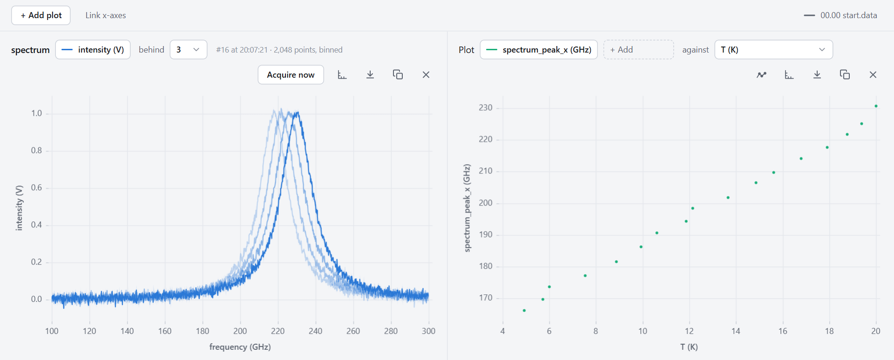
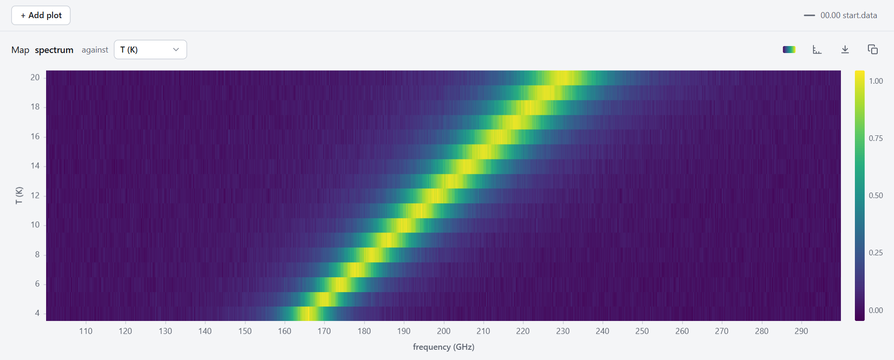

# Traces and Spectra

A **measurement** is one number a row: a temperature, a voltage. A **trace** is a whole array at once: a spectrum from a spectrum analyser, a sweep from a network analyser, a lock-in's capture buffer. `pyacquisition` takes traces beside the rows, saves them in a file of their own beside the data file, links each one to the row it was taken with, and shows them live in the interface.

This page uses a simulated rig, a cryostat with a lock-in on a sample in it (`examples/simulated_rig/simulated.py` in the repository), with a simulated spectrometer added: its sample has one resonance, which moves up in frequency as the sample warms. Nothing here needs hardware.

## Two ways to use a trace

Most experiments with a spectrum take it in one of two ways:

- **An occasional spectrum.** A sweep steps the temperature (or the field, or a gate voltage) and takes one spectrum at each step. The rows go on every quarter of a second as usual, and a few of them have a spectrum.
- **A spectrum with every row.** Each row takes a spectrum, and the row waits for it. The spectrum is usually reduced to a few numbers for the row (its mean, or where its peak is), so they can be plotted and saved like any other column.

Both are the same `Trace`, taken at different times.

## An occasional spectrum

Add the instrument, then the trace, in `setup()`:

```python title="traces_occasional.py"
--8<-- "examples/simulated_rig/traces_occasional.py:trace"
```

`get_spectrum` is the spectrometer's **trace method** (the instrument's author marks it as one, as a query is marked, and says what its channels are). `"spectrum"` names the trace. `reduce=["peak_x"]` adds a column, `spectrum_peak_x`, with the frequency at the spectrum's highest point.

A trace with no `every` or `every_rows` is taken only when it is asked for. A task asks with `AcquireTrace`, which takes a trace and waits for it. Here it is at each step of a temperature sweep, after `SetTemperature`, a small task that ramps the cryostat to a temperature and waits until it gets there:

```python title="traces_occasional.py"
--8<-- "examples/simulated_rig/traces_occasional.py:sweep"
```

`AcquireTrace` is registered by itself when an experiment has traces, so it is in **Add a task** and the command palette as well. If the trace can't be taken (the instrument raises an error, or takes longer than the trace's timeout), the task fails, which pauses the queue.

Each spectrum's number, from 0, goes in the `spectrum_index` column of the **first row taken after it**. The other rows leave that column empty. `spectrum_peak_x` is on the same row as its index:

```text
time,T,spectrum_index,spectrum_peak_x
81.25,19.998,,
81.50,20.001,3,229.9
81.75,20.003,,
```

### Seeing it

**+ Add plot** has a menu when the experiment has traces: a plot of columns as before, **Trace: spectrum**, or **Map: spectrum**.



A **trace panel** shows the latest spectrum against its own axis, and the few before it (**behind**, 3 by default) fainter. Zoom, pan, log axes, fixed limits and the readout work as on a plot. **Acquire now** takes one at once. It waits as long as the trace may take, so a slow sweep is fine. The note at the top says which trace it is and when it was taken, and hovering over it shows the row it was taken with. The export menu saves an image, or the latest trace at full resolution as CSV.

A spectrum of more than 1024 points is sent to the page in 1024 bins, and drawn as a band from each bin's lowest to highest value, with its mean as the line. A narrow spike still shows. The file has every point.



A **map panel** shows every spectrum of the current data file at once, as a colour map. x is the spectrum's axis. y is any column of the rows they were taken with (here `T`), or `time`, or when they were taken. Each spectrum is a strip reaching halfway to its neighbours, so uneven steps draw at their true size, and a long pause between spectra shows as a gap. The **Colour scale** button chooses the colour map, a log scale, and fixed limits instead of following the data.

`spectrum_peak_x` is a column like any other, so it can be plotted too. A column that is empty on most rows is drawn as a dot for each value, and its **Values** tile keeps its last value, dimmed, with how long ago it was.

## A spectrum with every row

Give the trace `every_rows`:

```python title="traces_every_row.py"
--8<-- "examples/simulated_rig/traces_every_row.py:trace"
```

Now each row takes a spectrum, and waits for it, so every row has `spectrum_index`, `spectrum_mean` and `spectrum_peak_x`. If the spectrum takes longer than the measurement period, the rows slow down to its pace. The **Every 0.5 s** button in the top bar shows how long the rows really take. `every_rows=4` takes one with every fourth row, and the rows in between leave its columns empty. A spectrum that fails leaves its row's columns empty, and the next row tries again.

## When a trace is taken

| Given | Taken | Its columns are on |
|---|---|---|
| neither | Only when asked: `AcquireTrace`, **Acquire now**, or `await experiment.traces["spectrum"].acquire()` from your own code | the first row after it |
| `every=10` | On a clock of its own, every 10 seconds, between the rows. Not while measuring is paused. | the first row after it |
| `every_rows=1` | Within each row (or every Nth), which waits for it | that row |

Only one of `every` and `every_rows` can be given. Asking for a trace while one is being taken waits for it, then takes another. A trace that takes longer than its `timeout` (the instrument's, or `timeout=` seconds) is stopped, and not saved.

## Reductions

`reduce` makes columns from each trace, on the row it is linked to:

| Reduction | Is | Unit |
|---|---|---|
| `"mean"`, `"min"`, `"max"`, `"sum"`, `"std"` | the channel's mean, lowest value, and so on (NaN left out) | the channel's |
| `"peak_x"` | where on the axis the channel is highest | the axis's |
| `"integral"` | the area under the channel, over its axis | none |

Your own reduction is a function of the channel's values, given as a dict with its name:

```python
Trace(
    "spectrum",
    spectrometer.get_spectrum,
    reduce={"mean": np.mean, "width": peak_width},
    reduce_units={"width": "GHz"},
)
```

If the function has a parameter called `x`, it is given the axis too: `def peak_width(values, x): ...`. `reduce_units` gives a reduction's unit where it isn't the one above.

The column is `spectrum_mean` for a trace with one channel. For a trace with several (an `X` and a `Y`, say), each reduction is made for each channel, as `spectrum_X_mean` and `spectrum_Y_mean`. A reduction that raises an error leaves its cell empty, and the error is logged once.

## The trace file

The traces are saved beside the data file, in a file of the same name ending `.h5`: `00.01 sweep.data` has `00.01 sweep.h5`. A trace file past 500 MB goes on in a new part, `00.01 sweep.001.h5`, and so on. It is an [HDF5](https://www.hdfgroup.org/solutions/hdf5/) file, which most analysis tools can read.

### With `read_traces`

`read_traces` reads a data file's traces, from all its parts, in order:

```python
from pyacquisition import read_traces

traces = read_traces("my_data/00.01 sweep.data", "spectrum")

traces.x                      # the axis (frequency, in GHz)
traces.channels["intensity"]  # a row per trace
traces.index                  # each trace's number: its spectrum_index
traces.info["row.T"]          # the temperature of the row it was taken with
```

`traces.info` has, for each trace, when it started and finished, and the latest row's values then, as `row_start.T` and `row.T`. So the spectra of a temperature sweep can be drawn against temperature without reading the data file at all:

```python
import matplotlib.pyplot as plt

plt.pcolormesh(traces.x, traces.info["row.T"], traces.channels["intensity"])
```

The name can be left out when the file has only one trace. To match spectra with the rows of the data file, index the rows that have one by `spectrum_index`, which is each spectrum's number in `traces.index`:

```python
import pandas as pd

rows = pd.read_csv("my_data/00.01 sweep.data")
taken = rows.dropna(subset=["spectrum_index"]).set_index("spectrum_index")
taken.loc[traces.index, "T"]  # the temperature of each spectrum's row
```

### With xarray or h5py

The file is laid out as a NetCDF4 file is, so [xarray](https://xarray.dev) reads each trace as a dataset, with its axis and the rows' values beside it (you need `xarray` and `h5netcdf` installed):

```python
import xarray as xr

spectra = xr.load_dataset("my_data/00.01 sweep.h5", group="spectrum", engine="h5netcdf")
```

Use `load_dataset`, not `open_dataset`. On Windows, a file that is open elsewhere can't be written, and `open_dataset` keeps it open until you close it. The experiment holds on to traces it can't write, and writes them once the file is free, but it is simpler not to hold the file.

With `h5py`, each trace is a group, with the channels as datasets of a row per trace:

```python
import h5py

with h5py.File("my_data/00.01 sweep.h5", "r") as f:
    intensity = f["spectrum/intensity"][:]
    temperature = f["spectrum/row.T"][:]
```

## In a config file

A [TOML file](toml_config.md#traces-section) describes traces in a `[traces]` section. The key is the trace's name:

```toml
--8<-- "examples/traces.toml"
```

This takes a spectrum from the included [`TraceGenerator`](../instruments/trace_generator.md) every 5 seconds. `every_rows`, `reduce`, `reduce_units`, `channels`, `timeout`, `unit`, `x_unit` and `args` (the trace method's inputs) can be given too. Your own reduction functions are Python only.

## Memory and file size

Three options in `[data]` (or on `Experiment`) set how much traces may take:

| Option | Default | |
|---|---|---|
| `trace_history_mb` | 64 | The memory the recent traces kept for the trace and map panels may take. The oldest go first. |
| `trace_file_mb` | 500 | The size past which a trace file goes on in a new part. |
| `trace_pending_mb` | 256 | The memory traces may take while their file can't be written. Past it, the oldest are dropped. |

## Your own instrument's traces

Any instrument can have trace methods. See [writing a trace method](custom_instruments.md#a-trace-method).
